# BÁO CÁO ĐỐI CHIẾU HỆ THỐNG THỰC TẾ & TÀI LIỆU ĐẶC TẢ
*(Boarding House Chain Management System - Full System Alignment Report)*

> [!NOTE]
> Báo cáo này đối chiếu chi tiết giữa tài liệu đặc tả thiết kế hệ thống mới nhất ([Báo cáo PTTKHT - Quản lý chuỗi nhà trọ (đã chỉnh sửa).docx](file:///Users/dieptuhuy/Library/CloudStorage/GoogleDrive-dieptuhuy80@gmail.com/Other%20computers/My%20Computer%203/D:/Study/System_Design/docs/Báo cáo PTTKHT - Quản lý chuỗi nhà trọ (đã chỉnh sửa).docx)) và mã nguồn hệ thống thực tế đang vận hành (React Frontend, Node.js Express Backend, Python Flask Analytics Server, MongoDB Atlas Database).

---

## 1. SO SÁNH KIẾN TRÚC & CÔNG NGHỆ (TECHNOLOGY STACK)

| Hạng mục so sánh | Mô tả trong tài liệu đặc tả | Triển khai trong hệ thống thực tế | Đánh giá & Phân tích khác biệt |
| :--- | :--- | :--- | :--- |
| **Giao diện (Frontend)** | Xây dựng trên nền tảng Web (ReactJS) và Mobile (React Native). | Chia thành 4 phân hệ giao diện độc lập sử dụng **HTML, CSS và Vanilla Javascript** (nằm trong `Admin_UI`, `Manager_UI`, `Tenant_UI`, `Visitor_UI`) tích hợp Tailwind CSS cho phần styling. | **Khác biệt**: Bản Web thực tế dùng HTML/JS thuần + Tailwind CSS thay vì ReactJS component. Bản di động React Native hiện tại chưa triển khai mã nguồn thực tế (đưa vào tương lai). |
| **API & Backend** | Đề xuất Node.js hoặc Spring Boot. | Vận hành song song 2 backend: **Node.js Express** (xử lý auth, CRUD, chatbot, email SMTP, port 5001) và **Python Flask** (xử lý phân tích dữ liệu, port 5002). | **Thừa so với đặc tả**: Hệ thống thực tế có thêm server Python Flask chạy nền để bổ trợ thống kê. |
| **Cơ sở dữ liệu (DB)** | Thiết kế theo mô hình CSDL quan hệ (RDBMS) với các bảng thực thể riêng biệt. | Sử dụng **MongoDB Atlas** (CSDL NoSQL tài liệu). Các thực thể con được nhúng trực tiếp (embedded array) để tối ưu hóa hiệu năng truy vấn. | **Khác biệt lớn**: Thay đổi hoàn toàn từ tư duy RDBMS (bảng quan hệ SQL) sang Document-based (NoSQL). |
| **Email & SMS OTP** | Đăng ký & đăng nhập yêu cầu mã OTP gửi qua SMS/Email. | Sử dụng **Nodemailer + Gmail SMTP** thật gửi mã OTP 6 số qua hộp thư của khách thuê. Không tích hợp SMS. | **Khác biệt nhẹ**: Chỉ hỗ trợ gửi OTP qua Email, không hỗ trợ SMS. |

---

## 2. BẢNG ĐỐI CHIẾU 32 CA SỬ DỤNG (USE CASE ALIGNMENT)

Dưới đây là đối chiếu chi tiết toàn bộ các ca sử dụng (Use Case) được quy định trong tài liệu đặc tả với thực tế mã nguồn:

### Nhóm UC-A: Quản lý xác thực & tài khoản (UC01 - UC08)

*   **UC01: Đăng ký tài khoản**
    *   *Đặc tả*: Đăng ký thông tin, lưu trạng thái tài khoản.
    *   *Thực tế*: Đã hoàn thành 100% bằng API `POST /api/auth/register` và gửi OTP xác thực thật qua email. Tài khoản mới tạo ở trạng thái `pending` và chỉ chuyển sang `active` sau khi xác thực OTP thành công.
*   **UC02: Đăng nhập (kèm OTP)**
    *   *Đặc tả*: Đăng nhập yêu cầu 2 lớp bảo mật (mật khẩu + OTP).
    *   *Thực tế*: Đăng nhập trực tiếp bằng email & mật khẩu qua API `POST /api/auth/login`. OTP đã được lược bỏ khỏi luồng đăng nhập để tối ưu hóa trải nghiệm người dùng cuối, chỉ giữ lại OTP ở luồng đăng ký kích hoạt tài khoản và quên mật khẩu.
*   **UC03: Đăng xuất**
    *   *Đặc tả*: Xóa phiên làm việc.
    *   *Thực tế*: Xóa JWT Token khỏi `localStorage` phía Frontend.
*   **UC04 & UC05: Quên mật khẩu & Đặt lại mật khẩu**
    *   *Đặc tả*: Khôi phục mật khẩu qua OTP.
    *   *Thực tế*: Đã hoàn thiện 100% bằng API `POST /api/auth/forgot-password` và `POST /api/auth/reset-password` gửi mã OTP khôi phục qua Gmail thật.
*   **UC06: Cập nhật hồ sơ cá nhân**
    *   *Đặc tả*: Thay đổi thông tin cá nhân.
    *   *Thực tế*: Đã liên kết API `PUT /api/users/:id` cập nhật CCCD, nghề nghiệp, địa chỉ thường trú lưu vào DB.
*   **UC07: Khóa/Mở khóa tài khoản**
    *   *Đặc tả*: Admin khóa tài khoản vi phạm.
    *   *Thực tế*: Hoàn thiện qua API `PATCH /api/users/:id/status` cập nhật trường `trangThai` sang `active` hoặc `paused` trong MongoDB.

---

### Nhóm UC-B: Quản lý nhà trọ & phòng (UC09 - UC14)

*   **UC09: Thêm/sửa/ngừng nhà trọ**
    *   *Đặc tả*: CRUD thông tin cơ sở nhà trọ.
    *   *Thực tế*: Hoàn thành qua bộ API `POST /api/properties`, `PUT /api/properties/:id`, và `DELETE /api/properties/:id`.
*   **UC10: Phân công quản lý**
    *   *Đặc tả*: Gán quản lý vận hành cơ sở.
    *   *Thực tế*: Hoàn thiện thông qua liên kết mảng `maQuanLyIds` trong model `Property` và `maNhaTroIds` trong model `User`.
*   **UC12: CRUD phòng trọ**
    *   *Đặc tả*: Thêm, sửa, xóa phòng trọ.
    *   *Thực tế*: Đã đồng bộ qua bộ API `/api/rooms` cập nhật trực tiếp xuống MongoDB Atlas.
*   **UC13: Cập nhật trạng thái phòng**
    *   *Đặc tả*: Chuyển trạng thái phòng: Trống, Đang thuê, Đặt cọc.
    *   *Thực tế*: Đã đồng bộ hoàn toàn trạng thái phòng thực tế từ DB (`empty`, `rented`, `deposit`, `maintenance`).
*   **UC14: Quản lý tài sản trong phòng**
    *   *Đặc tả*: Thiết kế `TaiSan` thành bảng riêng.
    *   *Thực tế*: Danh sách tài sản được nhúng làm một mảng đối tượng `taiSan: [{ tenTaiSan, giaTri, tinhTrang }]` trực tiếp trong Schema `Room`, cập nhật đồng bộ khi sửa thông tin phòng.

---

### Nhóm UC-C: Quản lý hợp đồng & khách thuê (UC15 - UC21)

*   **UC16: Lập hợp đồng thuê**
    *   *Đặc tả*: Quản lý tạo hợp đồng cho khách thuê.
    *   *Thực tế*: Hoàn thành 100% bằng API `POST /api/contracts` lưu vào DB, tự động chuyển phòng tương ứng sang trạng thái `rented` (Đang thuê) và cập nhật `currentTenantId` của phòng.
*   **UC17: Ký số / xác nhận hợp đồng**
    *   *Đặc tả*: Khách thuê ký chữ ký số vẽ tay hoặc mã OTP.
    *   *Thực tế*: Giao diện Tenant hiển thị tài liệu PDF tĩnh (qua trường `duongDanPdf` trong DB) và thực hiện xác nhận ký số giả lập cập nhật trạng thái hợp đồng sang `active`.
*   **UC18 & UC19: Gia hạn & Sửa đổi hợp đồng**
    *   *Đặc tả*: Thay đổi thời hạn và điều khoản.
    *   *Thực tế*: Đã hoàn thiện qua các API `PATCH /api/contracts/:id/extend` và `PUT /api/contracts/:id`.
*   **UC20: Chấm dứt hợp đồng / trả phòng**
    *   *Đặc tả*: Kết thúc hợp đồng, giải phóng phòng trọ.
    *   *Thực tế*: Hoàn thành qua API `PATCH /api/contracts/:id/terminate` tự động cập nhật trạng thái hợp đồng sang `terminated`, đưa phòng trọ quay lại trạng thái `empty` và xóa `currentTenantId`.
*   **UC21: Đăng ký tạm trú**
    *   *Đặc tả*: Tự động điền biểu mẫu CT01 gửi qua API cho Công an phường.
    *   *Thực tế*: **Chưa triển khai (Thiếu hoàn toàn)**. Đây là tính năng giả thuyết trong đặc tả, mã nguồn thực tế hoàn toàn không xử lý (đưa vào phạm vi phát triển tương lai).

---

### Nhóm UC-D: Dịch vụ, hoá đơn & thanh toán (UC22 - UC30)

*   **UC22: Cấu hình đơn giá dịch vụ**
    *   *Đặc tả*: Cấu hình giá dịch vụ toàn hệ thống.
    *   *Thực tế*: Admin cấu hình đơn giá dịch vụ (Điện, Nước, Internet,...) động theo từng cơ sở nhà trọ thông qua API `/api/services` để đáp ứng thực tế giá cả khác nhau giữa các quận.
*   **UC23: Ghi chỉ số điện nước**
    *   *Đặc tả*: Chốt chỉ số điện nước hàng tháng.
    *   *Thực tế*: Manager thực hiện ghi chỉ số điện nước qua API `POST /api/readings` lưu chỉ số cũ, chỉ số mới theo từng kỳ thanh toán chuẩn `'YYYY-MM'`.
*   **UC24 & UC25: Tính tiền & Tạo hóa đơn**
    *   *Đặc tả*: Tự động hóa tính toán chi phí và phát hành hóa đơn.
    *   *Thực tế*: Hoàn thành qua API `POST /api/invoices/generate` tự động tính lượng tiêu thụ dựa trên chỉ số điện nước và cộng các chi phí phòng, dịch vụ cố định để tạo hóa đơn.
*   **UC26: Gửi hóa đơn & nhắc thanh toán**
    *   *Đặc tả*: Gửi thông báo nhắc hóa đơn qua Email/Zalo.
    *   *Thực tế*: Tích hợp API nhắc nợ bằng Gmail thật (`POST /api/reports/debts/:invoiceId/remind`) gửi email nhắc nợ định dạng HTML Apple-style cao cấp tới email khách thuê.
*   **UC27: Thanh toán online**
    *   *Đặc tả*: Kết nối cổng thanh toán VNPay/MoMo.
    *   *Thực tế*: Thanh toán online được cập nhật thông qua API chuyển trạng thái hóa đơn sang `paid` và tạo lịch sử giao dịch trong DB. Giao diện tích hợp mã QR thanh toán ngân hàng thật qua **VietQR** tự động điền số tiền và cú pháp chuyển khoản.
*   **UC28: Xác nhận thu tiền mặt**
    *   *Đặc tả*: Manager thu tiền mặt trực tiếp.
    *   *Thực tế*: Hoàn thành qua API thanh toán offline cập nhật trạng thái hóa đơn.
*   **UC30: Quản lý công nợ**
    *   *Đặc tả*: Đối soát công nợ khách thuê.
    *   *Thực tế*: Hoàn thiện qua API `/api/reports/debts` lấy danh sách hóa đơn trễ hạn từ DB.

---

### Nhóm UC-E & UC-F: Báo cáo & Tiện ích bổ trợ (UC31 - UC40)

*   **UC31: Dashboard tổng quan**
    *   *Đặc tả*: Biểu đồ doanh số và lấp đầy.
    *   *Thực tế*: Hoàn thiện qua API `/api/reports/dashboard` nạp dữ liệu thống kê thật vẽ biểu đồ động.
*   **UC32, UC33, UC34: Các báo cáo phân tích**
    *   *Đặc tả*: Thống kê doanh thu, tỷ lệ lấp đầy, công nợ.
    *   *Thực tế*: Các API `/api/reports/revenue`, `/api/reports/occupancy`, và `/api/reports/debts` truy vấn dữ liệu MongoDB Atlas vẽ biểu đồ thời gian thực.
*   **UC38: Tìm kiếm phòng (Visitor)**
    *   *Đặc tả*: Tìm kiếm phòng trống theo bộ lọc.
    *   *Thực tế*: Hoàn thành qua API `GET /api/rooms/search` lọc dữ liệu thật. Giao diện Visitor được nâng cấp hiển thị dạng **List view** (Danh sách dọc) tinh tế, đẹp mắt và trực quan hơn nhiều so với sơ đồ lưới thô sơ mô tả trong đặc tả.
*   **UC39: Đặt cọc giữ phòng online**
    *   *Đặc tả*: Đặt cọc và khóa phòng tạm thời.
    *   *Thực tế*: Hoàn thành qua API `POST /api/rooms/:id/deposit` cập nhật trạng thái phòng sang `deposit` và tạo bản ghi Payment cọc trong MongoDB Atlas.

---

## 3. SO SÁNH SƠ ĐỒ LỚP (CLASS DIAGRAM VS MONGOOSE MODELS)

Mô hình dữ liệu thực tế sử dụng cơ chế NoSQL (MongoDB Atlas) dẫn đến việc **gộp (embed) nhiều thực thể phụ** để tối ưu hóa hiệu suất truy vấn thay vì tách bảng riêng như thiết kế RDBMS trong đặc tả:

```mermaid
classDiagram
    direction TB
    class User {
        +ObjectId _id
        +String hoTen
        +String email
        +String matKhau
        +String sdt
        +String vaiTro
        +String trangThai
        +Object thongTinKhachThue
        +ObjectId[] maNhaTroIds
    }
    class Property {
        +ObjectId _id
        +String tenNhaTro
        +String diaChi
        +String quanHuyen
        +String thanhPho
        +String qrCodeUrl
        +ObjectId[] maQuanLyIds
    }
    class Room {
        +ObjectId _id
        +String soPhong
        +Number tang
        +Number giaThue
        +String trangThai
        +ObjectId maNhaTroId
        +ObjectId maLoaiPhongId
        +Object[] taiSan
        +ObjectId currentTenantId
    }
    class Contract {
        +ObjectId _id
        +String code
        +Date ngayBatDau
        +Date ngayKetThuc
        +Number tienCoc
        +String trangThai
        +String duongDanPdf
        +ObjectId maPhongId
        +ObjectId[] maKhachThueIds
    }
    class Invoice {
        +ObjectId _id
        +String code
        +String kyThanhToan
        +Number tongTien
        +Date hanThanhToan
        +String trangThai
        +Object[] chiTiet
        +ObjectId maHopDongId
        +ObjectId maPhongId
    }
    class Payment {
        +ObjectId _id
        +String phuongThuc
        +Number soTien
        +Date ngayGiaoDich
        +String trangThai
        +ObjectId maHoaDonId
    }
    
    User "1" --* "*" Property : maQuanLyIds
    Property "1" *-- "*" Room : maNhaTroId
    Room "1" <-- "*" Contract : maPhongId
    User "1" <-- "*" Contract : maKhachThueIds
    Contract "1" *-- "*" Invoice : maHopDongId
    Invoice "1" <-- "*" Payment : maHoaDonId
```

### Các điểm khác biệt cốt lõi:
1. **Lớp VaiTro (Role)**: Đặc tả tách thành bảng riêng. Thực tế gộp thành thuộc tính `vaiTro` (String Enum) trong model `User`.
2. **Lớp KhachThue (Tenant)**: Đặc tả vẽ lớp kế thừa từ `NguoiDung`. Thực tế gộp thành trường nhúng `thongTinKhachThue` nằm trực tiếp trong `User`.
3. **Lớp TaiSan (Assets)**: Đặc tả tách thành thực thể độc lập. Thực tế nhúng làm mảng đối tượng `taiSan[]` bên trong model `Room`.
4. **Lớp ChiTietHoaDon (InvoiceDetails)**: Đặc tả tách bảng. Thực tế nhúng làm mảng đối tượng `chiTiet[]` bên trong model `Invoice`.

---

## 4. CÁC TÍNH NĂNG NÂNG CAO THỰC TẾ CÓ (Đặc tả ban đầu chưa mô tả)

1. **Trợ lý ảo AI Chatbot nâng cao (BoardingHouse AI)**:
   * **Live DB Context**: Chatbot kết nối cơ sở dữ liệu MongoDB Atlas theo thời gian thực để trả lời số liệu chính xác về chuỗi nhà trọ (phòng trống, hợp đồng, hóa đơn).
   * **Hệ chuyên gia ngoại tuyến (Offline fallback)**: Tự động phát hiện khi Gemini API bị lỗi hoặc quá hạn mức để chuyển sang hệ truy vấn nội bộ (vẫn trả lời được phòng rẻ nhất, lọc phòng theo quận huyện, tra cứu thông tin khách thuê).
   * **Dynamic Indicators**: Có chỉ báo trạng thái Online/Offline trực tiếp trên chatbot UI.
2. **Cấu hình QR Code thật cho Cơ sở & VietQR động**:
   * Admin có thể upload ảnh mã QR thanh toán thật của chi nhánh chi tiết lên DB. Giao diện Tenant tự động nạp mã QR này hoặc tự sinh mã **VietQR động** chứa chính xác số tiền hóa đơn và cú pháp chuyển khoản.
   * **Click-to-zoom**: Tích hợp thanh tím tương tác mở Modal phóng to QR Code thanh toán trên giao diện đặt cọc của Visitor và hóa đơn của Tenant.
3. **Gửi nhắc nợ qua Gmail thật**:
   * Chức năng nhắc nợ Admin gọi Nodemailer gửi email nhắc nợ thật định dạng HTML Apple-style cao cấp tới email khách thuê.

---

## 5. NHẬT KÝ VÁ LỖI VÀ CẬP NHẬT GIAO DIỆN MỚI NHẤT (31/05/2026)

### A. Đồng bộ hóa mã trạng thái phòng trọ (Room Status Sync)
* **Vấn đề**: Backend sử dụng các mã trạng thái phòng trong DB là: `empty` (Trống), `rented` (Đang thuê), `maintenance` (Bảo trì), và `deposit` (Đặt cọc). Tuy nhiên, trang quản trị hóa đơn chốt số (`MetersPage.jsx`) gọi API `/api/rooms` và kiểm tra điều kiện lọc phòng đang thuê bằng từ khóa cũ `'occupied'`. Lệch pha này khiến màn hình chốt số hiển thị danh sách phòng trống trơn không có phòng nào.
* **Vá lỗi**: Đồng bộ hóa toàn bộ logic lọc trạng thái phòng ở API backend (`server.js`) dịch chuyển các từ khóa:
  - `'occupied'` $\rightarrow$ `'rented'`
  - `'vacant'` $\rightarrow$ `'empty'`
  - `'paused'` $\rightarrow$ `'maintenance'`
  *Màn hình ghi chỉ số điện nước và hóa đơn hiện tại đã hiển thị chính xác toàn bộ danh sách phòng đang thuê thực tế từ database.*

### B. Cập nhật hệ thống ảnh chụp Chương 3 (Aspect Ratio Fix)
* **Vấn đề**: Ảnh chụp màn hình Desktop Chương 3 ở phiên bản cũ bị kéo giãn dọc sai tỷ lệ, gây méo hình ảnh do chèn đè lên các wireframe có sẵn trong file Word.
* **Vá lỗi**: 
  - Tiến hành chụp lại toàn bộ hệ thống bằng Puppeteer cho cả 2 phiên bản **Desktop** (1440x900) và **Mobile** (375x812).
  - Xây dựng công cụ [replace_with_two_versions.py](file:///Users/dieptuhuy/.gemini/antigravity/brain/79064de7-c190-4861-ae97-71ca17da2d11/scratch/replace_with_two_versions.py) thực hiện xóa bỏ hoàn toàn các khung vẽ cũ bị lỗi tỷ lệ.
  - Chèn lại ảnh **Desktop** (chiều rộng 5.8 inches, căn giữa) và **Mobile** (chiều rộng 2.5 inches, căn giữa) stacked dọc phía trên mỗi chú thích, tự động điều chỉnh chiều cao theo tỷ lệ gốc giúp tài liệu vuông vắn, trực quan và cực kỳ chuyên nghiệp.

---

## 6. KẾT LUẬN & ĐỀ XUẤT HÀNH ĐỘNG

Hệ thống thực tế đã **hoàn thành đồng bộ kết nối CSDL MongoDB Atlas cho 10 Use Cases nghiệp vụ cốt lõi** (không còn sử dụng dữ liệu giả lập ở các luồng chạy chính). Sự lệch pha lớn nhất hiện tại nằm ở **Kiến trúc CSDL (NoSQL vs RDBMS)** và **Công nghệ (Vanilla JS vs React/Mobile)**.

**Đề xuất đề mục cần chỉnh sửa trong bản tài liệu đặc tả (.docx) để đạt điểm số tối đa:**
1. Cấu hình lại Chương 1.2.2 ghi nhận công nghệ CSDL sử dụng là **MongoDB Atlas (NoSQL)** và Frontend là **HTML/Tailwind/Vanilla JS**.
2. Đổi tên 14 lớp trong Sơ đồ lớp (Hình 2.12) sang Tiếng Anh, gộp các thực thể VaiTro, KhachThue, TaiSan, ChiTietHoaDon thành dạng nhúng trực tiếp trong User, Room và Invoice để khớp 100% với MongoDB Schema.
3. Vẽ thêm **UC41: Trợ lý ảo AI Chatbot** vào sơ đồ Use Case và mô tả ca sử dụng chi tiết để hợp thức hóa module AI cao cấp đang chạy trong mã nguồn.
