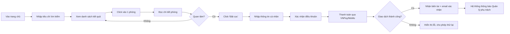
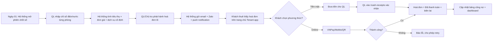
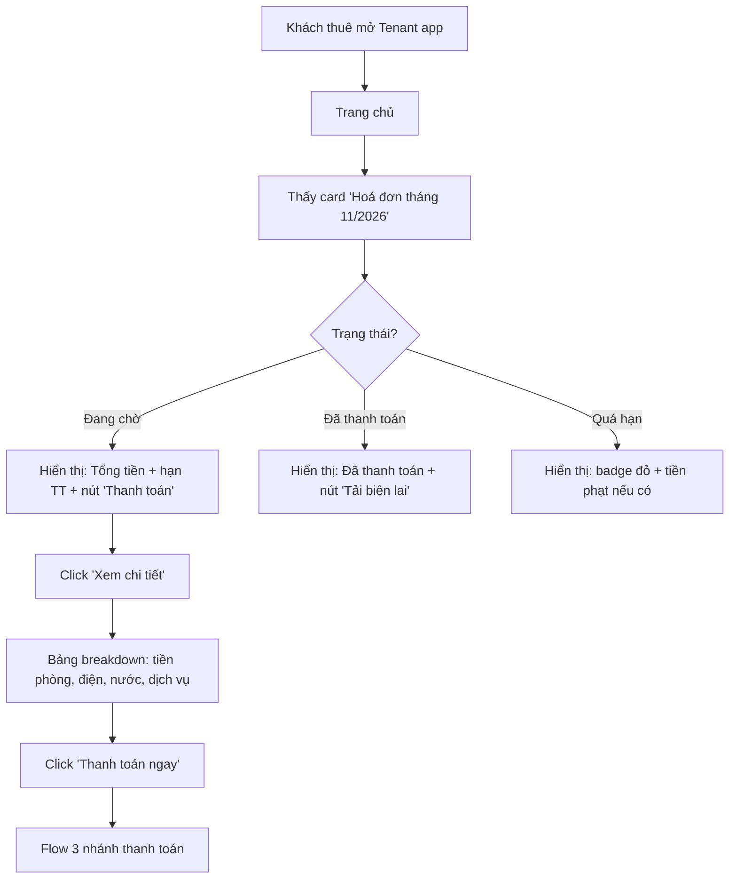
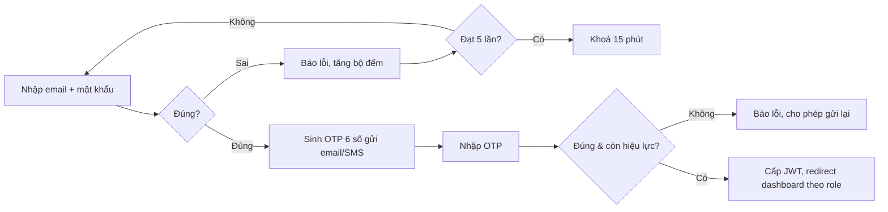

# UI Design Brief — Hệ thống Quản lý Chuỗi Nhà Trọ

> Tài liệu này tóm tắt toàn bộ phạm vi UI cho dự án, dành cho **designer / UI engineer** sử dụng trực tiếp khi vẽ wireframe & high-fidelity mockup. Mọi quyết định lấy từ báo cáo PTTKHT đã chốt: **4 actor** (Chủ trọ kiêm Admin, Quản lý, Khách thuê, Khách vãng lai), **6 nhóm chức năng**, **không có module bảo trì**.

---

## 1. Tổng quan sản phẩm

| Hạng mục | Mô tả |
|---|---|
| **Tên** | Hệ thống Quản lý Chuỗi Nhà Trọ |
| **Phạm vi** | Web app + Mobile-responsive cho khách thuê / khách vãng lai |
| **Multi-tenant** | Có — 1 Chủ trọ quản lý nhiều nhà trọ, mỗi nhà trọ có nhiều Quản lý |
| **Ngôn ngữ** | Tiếng Việt (mặc định), Tiếng Anh (phase 2) |
| **Thiết bị mục tiêu** | Desktop ≥ 1280 px, Tablet 768–1279 px, Mobile 360–767 px |
| **Trình duyệt hỗ trợ** | Chrome 90+, Edge 90+, Safari 14+, Firefox 90+ |

### Triết lý thiết kế
- **Modern minimalism** — không trang trí thừa, ưu tiên dữ liệu.
- **Role-aware UI** — mỗi vai trò chỉ thấy thông tin và thao tác liên quan đến mình.
- **Mobile-first cho khách thuê / khách vãng lai** (80% truy cập từ điện thoại); **desktop-first cho Chủ trọ / Quản lý**.
- **Inline editing, ít modal** — đặc biệt cho bảng dữ liệu (phòng, chỉ số, hoá đơn).

---

## 2. Design System

### 2.1 Bảng màu

| Token | Hex | Vai trò |
|---|---|---|
| `--color-primary` | `#3A5BC7` | CTA chính, link, focus ring |
| `--color-primary-dark` | `#2A4FBD` | Hover, heading nhấn |
| `--color-primary-soft` | `#E8EEF9` | Nền thẻ, badge nhẹ |
| `--color-bg` | `#F5F7FB` | Nền app |
| `--color-surface` | `#FFFFFF` | Card, modal, input |
| `--color-text` | `#1A1F36` | Văn bản chính |
| `--color-text-muted` | `#6B7280` | Văn bản phụ, hint |
| `--color-border` | `#E5E7EB` | Viền card, divider |
| `--color-success` | `#16A34A` | Đã thanh toán, phòng trống |
| `--color-warning` | `#F59E0B` | Đặt cọc, hạn sắp tới |
| `--color-danger` | `#DC2626` | Quá hạn, lỗi |
| `--color-info` | `#0EA5E9` | Thông báo thông tin |

### 2.2 Typography
- **Font**: Inter (web) — fallback `system-ui`.
- **Scale**:
  - `text-xs` 12 px — caption
  - `text-sm` 14 px — body phụ
  - `text-base` 16 px — body
  - `text-lg` 18 px — sub-heading
  - `text-xl` 20 px — heading nhỏ
  - `text-2xl` 24 px — heading trang
  - `text-3xl` 30 px — heading chính (dashboard)
- **Line-height**: 1.5 cho body, 1.3 cho heading.
- **Weight**: 400 (regular), 500 (medium), 600 (semibold), 700 (bold).

### 2.3 Spacing & Radius
- Spacing scale: `4 / 8 / 12 / 16 / 24 / 32 / 48 / 64 px` (bội của 4).
- Border-radius: `4` (input), `8` (card), `12` (modal), `9999` (badge/pill).

### 2.4 Component cơ bản (cần có trong UI Kit)

| Component | Biến thể | Ghi chú |
|---|---|---|
| **Button** | Primary, Secondary, Ghost, Danger, Link | + size sm/md/lg, có loading state |
| **Input** | Text, Number, Currency, Date, Search | + label, helper, error, prefix/suffix |
| **Select / Combobox** | Single, Multi | search-able cho danh sách dài |
| **Table** | Sortable, Filterable, Inline-edit | sticky header, pagination |
| **Card** | Stat, List item, Empty | bo 8 px, shadow nhẹ |
| **Badge / Pill** | Status, Count | màu theo trạng thái |
| **Modal** | Confirm, Form, Drawer | có overlay mờ |
| **Toast** | Success, Error, Info, Warning | tự ẩn 5s, có nút close |
| **Tabs** | Underline, Pill | dùng cho Tenant Portal |
| **Avatar** | User, Branch | có fallback chữ cái |
| **Empty state** | Icon + heading + CTA | bắt buộc cho mọi list |

### 2.5 Iconography
- **Phong cách**: line-icon 1.5 px stroke (gợi ý: Lucide / Heroicons outline).
- **Kích thước chuẩn**: 16 / 20 / 24 px.

---

## 3. Information Architecture

```
┌─ Public site (không cần đăng nhập)
│   ├─ Trang chủ giới thiệu
│   ├─ Tìm phòng (Search)
│   ├─ Chi tiết phòng
│   └─ Đặt cọc giữ phòng
│
└─ App có đăng nhập
    ├─ /admin             (Chủ trọ)
    │   ├─ Dashboard tổng quan
    │   ├─ Nhà trọ & chi nhánh
    │   ├─ Người dùng & phân quyền
    │   ├─ Hợp đồng
    │   ├─ Hoá đơn & công nợ
    │   ├─ Cấu hình dịch vụ & đơn giá
    │   ├─ Báo cáo & thống kê
    │   └─ Cài đặt hệ thống
    │
    ├─ /manager           (Quản lý)
    │   ├─ Dashboard chi nhánh
    │   ├─ Phòng & tài sản
    │   ├─ Khách thuê & hợp đồng
    │   ├─ Ghi chỉ số điện nước
    │   ├─ Xác nhận thu tiền mặt
    │   └─ Thông báo
    │
    └─ /tenant            (Khách thuê)
        ├─ Trang chủ (hoá đơn tháng hiện tại)
        ├─ Lịch sử hoá đơn
        ├─ Hợp đồng của tôi
        ├─ Thanh toán
        └─ Hồ sơ cá nhân
```

---

## 4. Ma trận vai trò & quyền hạn (RBAC)

| Tính năng | Chủ trọ | Quản lý | Khách thuê | Khách vãng lai |
|---|:-:|:-:|:-:|:-:|
| Đăng ký / Đăng nhập | ✅ | ✅ | ✅ | ✅ (đăng ký mới) |
| Quản trị tài khoản người dùng | ✅ | — | — | — |
| Thêm / sửa / ngừng nhà trọ | ✅ | — | — | — |
| Phân công Quản lý | ✅ | — | — | — |
| CRUD phòng & tài sản | xem | ✅ | — | — |
| Cấu hình đơn giá dịch vụ | ✅ | — | — | — |
| Ghi chỉ số điện nước | xem | ✅ | — | — |
| Lập hợp đồng | xem | ✅ | xem (của mình) | — |
| Ký số hợp đồng | — | — | ✅ (của mình) | — |
| Tạo / sửa hoá đơn | ✅ | — | — | — |
| Xem hoá đơn tổng cuối tháng | ✅ (toàn chuỗi) | ✅ (cơ sở phụ trách) | ✅ (của mình) | — |
| Xác nhận thu tiền mặt | ✅ | ✅ | — | — |
| Thanh toán hoá đơn online | — | — | ✅ | — |
| Quản lý công nợ | ✅ | xem | — | — |
| Báo cáo & thống kê | ✅ | — | — | — |
| Tìm phòng | xem | xem | xem | ✅ |
| Đặt cọc giữ phòng | — | — | — | ✅ |

---

## 5. Đặc tả UI từng Actor

### 5.1 Chủ trọ (Admin) — `/admin`

#### Layout chuẩn (Desktop ≥ 1280 px)

```
┌────────────────────────────────────────────────────────────────┐
│  [Logo]  Nhà trọ Tốt   [Search]              [🔔3] [Avatar ▾] │  ← Top bar 64 px
├──────────┬─────────────────────────────────────────────────────┤
│ Sidebar  │  Breadcrumb                                          │
│ 240 px   │  ─────────────────────────────────────────────────── │
│          │  Page heading + actions                              │
│  📊 Tổng │                                                       │
│  🏠 Nhà  │  CONTENT AREA                                         │
│  👥 User │                                                       │
│  📝 HĐ  │                                                       │
│  💰 HD  │                                                       │
│  ⚙ DV   │                                                       │
│  📈 BC  │                                                       │
│          │                                                       │
└──────────┴─────────────────────────────────────────────────────┘
```

#### Trang 1 — Dashboard tổng quan (`/admin`)
- **KPI cards** (grid 4 cột): Doanh thu tháng / Tỉ lệ lấp đầy / Công nợ chưa thu / Chi phí vận hành. Mỗi card có icon, số lớn, delta vs tháng trước (mũi tên xanh/đỏ).
- **Biểu đồ đường** "Doanh thu 12 tháng theo cơ sở" (chiếm 8/12 cột) — overlay nhiều line, có legend tương tác.
- **Bản đồ Việt Nam** đánh marker các nhà trọ (chiếm 4/12 cột) — màu marker theo health (xanh/vàng/đỏ).
- **Bảng top 5** cơ sở doanh thu cao nhất / công nợ lớn nhất (toggle).
- **Activity feed** bên phải: thông báo hệ thống (hợp đồng sắp hết hạn, hoá đơn quá hạn).

#### Trang 2 — Nhà trọ & chi nhánh (`/admin/properties`)
- **Header**: nút "Thêm nhà trọ" (Primary, có icon +).
- **Card grid** mỗi card = 1 nhà trọ: ảnh đại diện, tên, địa chỉ, số phòng (đang thuê/tổng), QL phụ trách, menu (sửa / ngừng / xem chi tiết).
- **Modal "Thêm/Sửa nhà trọ"**: form 2 cột — tên, mã, địa chỉ (text + bản đồ pick toạ độ), upload ảnh, gán Quản lý (select có search).

#### Trang 3 — Người dùng & phân quyền (`/admin/users`)
- **Tabs**: Tất cả / Quản lý / Khách thuê / Khoá.
- **Table**: Avatar | Họ tên | Email | Vai trò | Nhà trọ phụ trách | Trạng thái | Hành động.
- **Bulk actions**: Khoá, Reset mật khẩu, Đổi vai trò.
- **Modal "Tạo Quản lý mới"**: form họ tên + email + SĐT + chọn các nhà trọ phụ trách (multi-select).

#### Trang 4 — Hợp đồng (`/admin/contracts`)
- **Filter row**: cơ sở (dropdown), trạng thái (chip: Hiệu lực / Sắp hết hạn / Đã kết thúc / Chờ ký), khoảng ngày.
- **Table**: Mã HĐ | Khách thuê | Phòng | Cơ sở | Ngày BĐ | Ngày KT | Trạng thái | Hành động (xem PDF, gia hạn, chấm dứt).
- **Slide-over panel** khi click 1 hàng: hiển thị PDF preview bên phải + thông tin tóm tắt.

#### Trang 5 — Hoá đơn & công nợ (`/admin/invoices`)
- **2 sub-tabs**: "Hoá đơn" / "Công nợ".
- **Tab Hoá đơn**:
  - Filter: kỳ (tháng/năm), cơ sở, trạng thái.
  - Bulk-action: "Phát hành lô" (chọn nhiều → tạo nhanh).
  - Table: Mã | Khách thuê | Kỳ | Tổng tiền | Hạn TT | Trạng thái (Đã thanh toán / Đang chờ / Quá hạn) | Hành động.
- **Tab Công nợ**:
  - Bảng tổng hợp theo khách thuê: số tháng nợ, tổng nợ, ngày quá hạn lâu nhất.
  - CTA "Gửi nhắc nợ hàng loạt".

#### Trang 6 — Cấu hình dịch vụ & đơn giá (`/admin/services`)
- **Bảng đơn giá**: Dịch vụ | Đơn vị | Đơn giá (bậc thang nếu có) | Áp dụng cho cơ sở | Hiệu lực từ.
- **Inline-editable** giá; có toggle bật/tắt từng dịch vụ theo cơ sở.
- **Modal "Thiết lập bậc thang điện"**: nhiều dòng "từ-đến kWh / đơn giá".

#### Trang 7 — Báo cáo & thống kê (`/admin/reports`)
- **Sidebar phụ** (filter): khoảng thời gian, cơ sở, loại báo cáo.
- **Tabs nội dung**: Doanh thu / Tỉ lệ lấp đầy / Công nợ / Chi phí.
- **Mỗi tab**: 1 biểu đồ lớn + 1 bảng số liệu chi tiết bên dưới + nút **Xuất Excel / Xuất PDF** ở góc trên phải.

#### Trang 8 — Cài đặt (`/admin/settings`)
- Thông tin doanh nghiệp, mẫu hợp đồng PDF (upload), kênh thông báo (email SMTP, Zalo OA, SMS), tích hợp cổng thanh toán (API key VNPay/MoMo).

---

### 5.2 Quản lý (Manager) — `/manager`

> Layout tương tự Admin nhưng Sidebar gọn hơn, có **Branch Switcher** ở đỉnh Sidebar nếu phụ trách nhiều cơ sở.

#### Trang 1 — Dashboard chi nhánh (`/manager`)
- **3 KPI cards**: Phòng đang trống / Hoá đơn cần phát hành / Tiền mặt cần đối soát.
- **Lịch tháng** đánh dấu: ngày 1 — chốt chỉ số; cuối tháng — phát hành hoá đơn; hợp đồng sắp hết hạn.
- **Danh sách tác vụ hôm nay** dạng checklist.

#### Trang 2 — Phòng & tài sản (`/manager/rooms`)
- **Grid view** (mặc định) hoặc Table view (toggle ở góc).
- **Mỗi phòng = thẻ vuông** 120×120 px:
  - Mã phòng to ở giữa.
  - Màu nền theo trạng thái: 🟢 trống / 🔵 đang thuê / 🟡 đặt cọc / ⚫ ngưng cho thuê.
  - Hover: hiện 3 nút nhỏ — "Sửa", "Đổi trạng thái", "Tài sản".
- **Filter bar**: tầng, loại phòng, giá, search theo mã/khách.
- **Slide-over "Chi tiết phòng"**: tab "Thông tin" / "Tài sản" / "Lịch sử thuê" / "Lịch sử hoá đơn".

#### Trang 3 — Khách thuê & hợp đồng (`/manager/contracts`)
- Table tương tự Admin nhưng **scoped** vào các cơ sở Quản lý phụ trách.
- **CTA "Lập hợp đồng mới"**: stepper 3 bước
  - **Bước 1** — Chọn phòng (gallery phòng trống).
  - **Bước 2** — Chọn / tạo khách thuê (form CCCD, họ tên, SĐT, nghề nghiệp; có option "Đăng ký tạm trú").
  - **Bước 3** — Điều khoản (thời hạn, tiền cọc, giá thuê, dịch vụ kèm) → Preview PDF → "Gửi link ký số".

#### Trang 4 — Ghi chỉ số điện nước (`/manager/meters`)
- **Bảng inline-editable**:
  - Cột: Phòng | Khách thuê | Chỉ số điện cũ | Chỉ số điện mới | Tiêu thụ | Chỉ số nước cũ | Chỉ số nước mới | Tiêu thụ | Tổng dự kiến.
  - 2 cột chỉ số mới có ô input, các cột khác tự tính realtime.
  - **Sticky toolbar dưới**: "Lưu nháp" (Ghost) / "Gửi cảnh báo bất thường" (Warning) / **"Phát hành hoá đơn lô"** (Primary).
- **Cell warning**: viền vàng khi tiêu thụ vượt 200% tháng trước.

#### Trang 5 — Xác nhận thu tiền mặt (`/manager/cash-receipts`)
- **Danh sách hoá đơn đang chờ xác nhận tiền mặt** (do khách báo đã chuyển khoản/đưa tiền nhưng chưa khớp).
- Mỗi item có 2 nút: "✅ Xác nhận đã thu" / "❌ Từ chối + nêu lý do".
- **Modal xác nhận**: chọn ngày thu, số tiền thực thu, ghi chú; có upload ảnh biên lai.

#### Trang 6 — Thông báo (`/manager/notifications`)
- Inbox dạng feed: hợp đồng cần ký, hoá đơn cần phát hành, khách đặt cọc mới, công nợ tới hạn.
- Filter: Tất cả / Chưa đọc / Quan trọng.

---

### 5.3 Khách thuê (Tenant) — `/tenant` *(mobile-first)*

> Toàn bộ UI dành cho mobile (360–767 px) là **chính**; desktop là rộng hơn nhưng giữ layout 1 cột.

#### Layout chuẩn
```
┌─────────────────────────┐
│ [☰]  Nhà trọ A    [🔔] │  ← App bar 56 px
├─────────────────────────┤
│                         │
│       Nội dung          │
│                         │
├─────────────────────────┤
│ [🏠] [📋] [💳] [👤]    │  ← Bottom tab 64 px
└─────────────────────────┘
```
Bottom tab: **Trang chủ / Hợp đồng / Hoá đơn / Hồ sơ**.

#### Trang 1 — Trang chủ (`/tenant`)
- **Greeting card**: "Xin chào Nguyễn Văn A — Phòng 305, Nhà trọ A".
- **Card "Hoá đơn tháng này"** (component chính, làm nổi bật):
  - Kỳ: 11/2026
  - Tổng tiền (font lớn): `5.420.000 đ`
  - Hạn thanh toán: 05/12/2026 (badge "Còn 3 ngày" / "Quá hạn 2 ngày")
  - Breakdown rút gọn: Tiền phòng 4.000.000 · Điện 850k · Nước 220k · Internet 150k · Dịch vụ 200k.
  - CTA **"Thanh toán ngay"** (full width, primary).
- **Section "Thông báo gần đây"** (max 3, có "Xem tất cả").
- **Section "Hợp đồng của tôi"**: thẻ tóm tắt hợp đồng hiệu lực, link "Xem chi tiết".

#### Trang 2 — Hợp đồng (`/tenant/contracts`)
- Danh sách thẻ (1 cột) — mỗi thẻ là 1 hợp đồng (hiện tại + lịch sử):
  - Mã HĐ, phòng, thời hạn, trạng thái.
  - CTA: "Xem PDF", "Yêu cầu gia hạn" (mở form đơn giản gửi cho QL).
- **Trang chi tiết hợp đồng**: PDF viewer full-screen + nút "Tải về".

#### Trang 3 — Hoá đơn (`/tenant/invoices`)
- **Filter chip**: Chưa thanh toán / Đã thanh toán / Tất cả.
- **List items**: kỳ + tổng tiền + badge trạng thái + chevron.
- **Trang chi tiết hoá đơn**:
  - Header: kỳ, tổng tiền, hạn thanh toán, trạng thái.
  - **Bảng chi tiết** (chi phí từng dòng): Dịch vụ | Số lượng | Đơn giá | Thành tiền. Có cả chỉ số điện/nước (cũ → mới → tiêu thụ).
  - Nút "Thanh toán ngay" (nếu chưa thanh toán) hoặc "Tải biên lai" (đã thanh toán).

#### Trang 4 — Thanh toán (flow)
- **Bước 1**: chọn phương thức (radio cards: VNPay / MoMo / QR Banking / Tiền mặt — "tôi sẽ trả cho Quản lý").
- **Bước 2 (Online)**: redirect đến cổng → quay về.
- **Bước 2 (Tiền mặt)**: hiển thị mã giao dịch + hướng dẫn "Đưa cho QL để xác nhận"; trạng thái hoá đơn = "Chờ xác nhận tiền mặt".
- **Màn hình thành công**: biên lai PDF + nút "Chia sẻ" / "Tải về".

#### Trang 5 — Hồ sơ (`/tenant/profile`)
- Avatar + thông tin cá nhân (đổi avatar, đổi SĐT, đổi email).
- Section "Bảo mật": đổi mật khẩu, bật 2FA.
- Section "Thông báo": toggle email / SMS / Zalo / push.
- Nút "Đăng xuất" ở cuối (Ghost, màu Danger).

---

### 5.4 Khách vãng lai (Visitor) — Public site

> Không yêu cầu đăng nhập. Tối ưu **SEO** và **mobile**.

#### Trang 1 — Trang chủ (`/`)
- **Hero**: ảnh nhà trọ + tagline + form tìm kiếm nhanh (Khu vực · Khoảng giá · Số người · nút "Tìm phòng").
- **Section "Nổi bật"**: 3-4 nhà trọ tiêu biểu (card có ảnh, tên, địa chỉ, số phòng trống, giá từ…).
- **Section "Vì sao chọn chúng tôi"**: 4 cột icon + heading + mô tả ngắn (Minh bạch giá / Thanh toán online / Hợp đồng số / Đa khu vực).
- **Footer**: thông tin liên hệ, điều khoản, FAQ.

#### Trang 2 — Tìm phòng (`/rooms`)
- **Layout 2 cột (desktop)** / **1 cột + filter drawer (mobile)**:
  - **Sidebar filter** bên trái: khu vực (multi-select quận/huyện), khoảng giá (range slider), diện tích, tiện nghi (checkbox: WC riêng / Gác / Máy lạnh / Wifi…), nhà trọ.
  - **Khu vực kết quả**: grid 3 cột (desktop) / 1 cột (mobile).
  - **Mỗi thẻ phòng**: ảnh chính, tên/mã phòng, địa chỉ rút gọn, giá/tháng, diện tích, badge "Còn trống" / "Đặt cọc".
- **Toggle xem**: Grid / List / Bản đồ.
- **Sort**: Mới nhất / Giá thấp / Giá cao / Gần trung tâm.

#### Trang 3 — Chi tiết phòng (`/rooms/[id]`)
- **Gallery ảnh** (carousel, full-width trên mobile).
- **Header**: tên phòng, địa chỉ, badge trạng thái, giá to.
- **Section thông tin**: diện tích, tầng, tiện nghi (tag list), dịch vụ kèm + đơn giá tham khảo.
- **Bản đồ vị trí** (Leaflet/Google Maps embed).
- **Card "Đặt cọc giữ phòng"** sticky bên phải (desktop) / dưới cùng (mobile):
  - Giá: 500.000đ (tham khảo, có thể tuỳ chỉnh theo từng nhà trọ).
  - CTA **"Đặt cọc ngay"** primary.
  - Link nhỏ: "Liên hệ chủ trọ".

#### Trang 4 — Đặt cọc (`/rooms/[id]/deposit`)
- **Stepper 3 bước**:
  - **Bước 1 — Thông tin**: họ tên, CCCD, SĐT, email (form ngắn).
  - **Bước 2 — Xác nhận**: hiển thị tóm tắt phòng + số tiền cọc + điều khoản (checkbox "Tôi đồng ý chính sách cọc giữ phòng").
  - **Bước 3 — Thanh toán**: redirect cổng VNPay/MoMo/QR.
- **Màn hình thành công**: biên lai cọc PDF + thông tin "Quản lý sẽ liên hệ trong 24h để ký hợp đồng".

---

## 6. Core User Flows

### Flow 1 — Khách vãng lai tìm phòng & đặt cọc



### Flow 2 — Quản lý lập hợp đồng & khách thuê ký số

```mermaid
flowchart LR
    A[QL vào /manager/contracts] --> B[Click 'Lập hợp đồng mới']
    B --> C[Bước 1: Chọn phòng trống]
    C --> D[Bước 2: Chọn/tạo hồ sơ khách thuê]
    D --> E[Bước 3: Nhập điều khoản]
    E --> F[Preview PDF hợp đồng]
    F --> G[Hệ thống gửi link ký số cho khách qua email/Zalo]
    G --> H[Khách thuê mở link, xem PDF]
    H --> I{Đồng ý?}
    I -- Có --> J[Nhập OTP để ký số]
    J --> K[Hệ thống nhúng chữ ký vào PDF]
    K --> L[Hợp đồng = Hiệu lực, Phòng = Đang thuê]
    L --> M[Khách nhận biên lai + welcome email]
    I -- Không --> N[Hợp đồng = Đã huỷ, Phòng = Trống]
```



### Flow 3 — Chu trình hoá đơn cuối tháng (Khách thuê là điểm chạm cuối)



### Flow 4 — Khách thuê xem hoá đơn cuối tháng



### Flow 5 — Đăng nhập có OTP (2FA)



---

## 7. State machines (luồng trạng thái)

### Phòng trọ
```
[Trống] ──(đặt cọc)──▶ [Đặt cọc]
   ▲                       │
   │                  (ký hợp đồng)
   │                       ▼
   │                  [Đang thuê]
   │                       │
   │                  (trả phòng)
   └───────────────────────┘
   
[Trống]/[Đang thuê] ──(ngưng kinh doanh)──▶ [Ngưng]
```

### Hợp đồng
```
[Dự thảo] ──(gửi link ký số)──▶ [Chờ ký]
                                    │
                              ┌─────┴─────┐
                          (ký)       (từ chối / quá 48h)
                              ▼             ▼
                        [Hiệu lực]      [Đã huỷ]
                              │
                  ┌───────────┼───────────┐
              (gia hạn)  (chấm dứt)  (hết hạn)
                  ▼           ▼           ▼
            [Hiệu lực]  [Đã kết thúc] [Hết hạn]
```

### Hoá đơn
```
[Bản nháp] ──(phát hành)──▶ [Đang chờ]
                                 │
                ┌────────────────┼────────────────┐
        (online thành công)  (đưa tiền mặt)  (quá hạn TT)
                ▼                  ▼                ▼
        [Đã thanh toán]   [Chờ xác nhận]      [Quá hạn]
                                  │                │
                          (QL xác nhận)    (TT trễ)
                                  ▼                │
                          [Đã thanh toán] ◀────────┘
```

---

## 8. Notifications & Empty states

### Notifications (cần thiết kế)
| Sự kiện | Kênh | Người nhận | Mức độ |
|---|---|---|---|
| Hoá đơn mới phát hành | Email + Zalo + Push | Khách thuê | Cao |
| Nhắc thanh toán (T-3, T-1, hạn) | Email + Push | Khách thuê | Cao |
| Hoá đơn quá hạn | Email + SMS | Khách thuê + Chủ trọ | Rất cao |
| Khách đặt cọc mới | Email + Push | QL + Chủ trọ | Cao |
| Hợp đồng cần ký | Email + Zalo | Khách thuê | Cao |
| Hợp đồng sắp hết hạn (T-30, T-14, T-7) | Email | Khách thuê + QL | Trung |
| Đăng nhập bất thường | Email | Người dùng đó | Cao |

### Empty states (mỗi list/table phải có)
- **Khách thuê chưa có hoá đơn**: icon hoá đơn + "Chưa có hoá đơn nào. Hoá đơn tháng đầu tiên sẽ được phát hành vào cuối tháng."
- **Quản lý chưa có phòng**: icon nhà + "Chưa có phòng nào trong nhà trọ này. Bắt đầu bằng cách thêm phòng đầu tiên." + CTA.
- **Visitor không có kết quả tìm kiếm**: icon search + "Không tìm thấy phòng phù hợp. Thử mở rộng tiêu chí?" + nút reset filter.

---

## 9. Responsive breakpoints

| Breakpoint | Min width | Layout |
|---|---|---|
| `xs` (mobile) | 360 px | 1 cột, bottom tab, hamburger menu |
| `sm` | 640 px | 1-2 cột, modal cố định 90% width |
| `md` (tablet) | 768 px | Sidebar collapsible, table có thể scroll ngang |
| `lg` (desktop) | 1024 px | Sidebar full, grid 3 cột |
| `xl` | 1280 px | Layout chuẩn — sidebar + content + (sidebar phụ) |
| `2xl` | 1536 px | Tăng max-width content lên 1440 px |

---

## 10. Tính toàn vẹn UX — Checklist trước khi giao designer

- [ ] Mọi action có **loading state** (skeleton hoặc spinner).
- [ ] Mọi form có **validation realtime** + lỗi hiển thị inline.
- [ ] Mọi list có **empty state** với CTA hành động.
- [ ] Mọi modal đều có nút "Huỷ" / "X" và ESC để đóng.
- [ ] **Confirm modal** cho thao tác phá huỷ (xoá, huỷ, ngừng).
- [ ] **Toast** xác nhận sau mọi thao tác thành công.
- [ ] Có **dark-mode token** dự phòng (chưa cần thiết kế đầy đủ).
- [ ] **Keyboard accessibility**: tab order, focus ring, ESC, Enter.
- [ ] **ARIA labels** cho icon-only button.
- [ ] **Tone & voice**: thân thiện, tiếng Việt tự nhiên, tránh thuật ngữ quá kỹ thuật cho khách thuê.

---

## 11. Deliverables mong đợi từ designer

1. **Wireframe lo-fi** toàn bộ flow (cho duyệt trước khi vẽ chi tiết).
2. **High-fidelity mockup** cho:
   - 8 trang Admin
   - 6 trang Manager
   - 5 trang Tenant (mobile + desktop)
   - 4 trang Visitor (mobile + desktop)
3. **Component library** Figma (theo Design System ở mục 2).
4. **Prototype** mô phỏng Flow 1, 2, 3, 4 ở mục 6.
5. **Specs export** cho dev (CSS / Token / Asset).
6. **Style guide** PDF tóm tắt 1 trang.

---

*Tài liệu này sẽ tiếp tục cập nhật khi có thay đổi nghiệp vụ. Mọi câu hỏi gửi về team Phân tích nghiệp vụ.*
