# 📊 Tổng Hợp Mã Nguồn PlantUML Các Sơ Đồ Hệ Thống
Tài liệu này chứa toàn bộ mã nguồn PlantUML của 19 sơ đồ thiết kế hệ thống BoardingHouse Pro, phục vụ đặc tả phân tích hệ thống.
**Bản cập nhật 02/07/2026 (tối) — khớp mã nguồn hệ thống (chatbot mở công khai theo commit ae176dd), kế thừa actor, không đánh số UC trong nhãn.**

## 📌 Danh Mục Sơ Đồ
1. [2.01_uc_overall.puml](#201-uc-overallpuml) — *Hình 2.1 — Sơ đồ Use Case tổng quát: Hệ thống Quản lý chuỗi Nhà trọ*
2. [2.02_uc_auth.puml](#202-uc-authpuml) — *Hình 2.2 — Use Case nhóm A: Quản lý xác thực & tài khoản*
3. [2.03_uc_room.puml](#203-uc-roompuml) — *Hình 2.3 — Use Case nhóm B: Quản lý nhà trọ, chi nhánh & phòng*
4. [2.04_uc_contract.puml](#204-uc-contractpuml) — *Hình 2.4 — Use Case nhóm C: Quản lý hợp đồng & khách thuê*
5. [2.05_uc_billing.puml](#205-uc-billingpuml) — *Hình 2.5 — Use Case nhóm D: Dịch vụ, ghi chỉ số, hoá đơn & thanh toán*
6. [2.06_uc_report.puml](#206-uc-reportpuml) — *Hình 2.6 — Use Case nhóm E: Báo cáo & thống kê vận hành*
7. [2.06b_uc_utilities.puml](#206b-uc-utilitiespuml) — *Hình 2.6b — Use Case nhóm F: Tiện ích bổ trợ (Nhắc nợ, Tìm kiếm, Đặt cọc & AI Chatbot)*
8. [2.07_act_register_otp.puml](#207-act-register-otppuml) — *Hình 2.7 — Hoạt động: Đăng ký tài khoản & Kích hoạt OTP qua Email*
9. [2.08_act_room.puml](#208-act-roompuml) — *Hình 2.8 — Hoạt động: Quản lý phòng (Thêm / Sửa / Trạng thái / Tài sản / Xoá)*
10. [2.09_act_contract_sign.puml](#209-act-contract-signpuml) — *Hình 2.9 — Hoạt động: Lập hợp đồng & Ký xác nhận (giả lập)*
11. [2.10_act_meter_invoice.puml](#210-act-meter-invoicepuml) — *Hình 2.10 — Hoạt động: Ghi chỉ số & Phát hành hoá đơn theo lô*
12. [2.11_act_payment.puml](#211-act-paymentpuml) — *Hình 2.11 — Hoạt động: Thanh toán hoá đơn (VNPay / Chuyển khoản VietQR / Tiền mặt)*
13. [2.12_class_diagram.puml](#212-class-diagrampuml) — *Hình 2.12 — Sơ đồ lớp (NoSQL — MongoDB Atlas): 11 collection + 4 lớp nhúng*
14. [2.13_seq_register_otp.puml](#213-seq-register-otppuml) — *Hình 2.13 — Tuần tự: UC01 Đăng ký + Kích hoạt OTP qua Email*
15. [2.14_seq_contract_sign.puml](#214-seq-contract-signpuml) — *Hình 2.14 — Tuần tự: UC16 + UC17 Tạo & Ký xác nhận hợp đồng (giả lập)*
16. [2.15_seq_meter_invoice.puml](#215-seq-meter-invoicepuml) — *Hình 2.15 — Tuần tự: UC22 + UC24 Ghi chỉ số & Phát hành hoá đơn lô*
17. [2.16_seq_payment_vnpay.puml](#216-seq-payment-vnpaypuml) — *Hình 2.16 — Tuần tự: UC26 Thanh toán hoá đơn online (VNPay Sandbox / VietQR / Tiền mặt)*
18. [2.17_seq_chatbot_ai.puml](#217-seq-chatbot-aipuml) — *Hình 2.17 — Tuần tự: UC39 Trợ lý ảo AI Chatbot (Gemini trực tuyến + Dự phòng ngoại tuyến)*
19. [2.18_architecture.puml](#218-architecturepuml) — *Hình 2.18 — Kiến trúc triển khai thực tế (3 tầng)*

---

## 2.01_uc_overall.puml

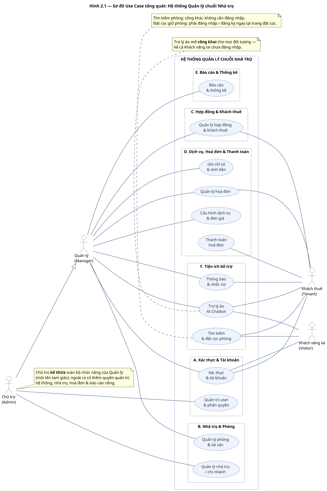
```plantuml
@startuml UC_Overall
title Hình 2.1 — Sơ đồ Use Case tổng quát: Hệ thống Quản lý chuỗi Nhà trọ

skinparam dpi 150
skinparam shadowing false
skinparam defaultFontName "Segoe UI"
skinparam defaultFontSize 13
skinparam packageStyle rectangle
skinparam ArrowColor #34507A
skinparam packageBackgroundColor #FFFFFF
skinparam packageBorderColor #9DB2D6
skinparam usecase {
  BackgroundColor #EEF3FC
  BorderColor #3A5BC7
  FontColor #1F2D3D
}
skinparam actor {
  BackgroundColor #FFFFFF
  BorderColor #2E7D32
}
left to right direction

actor "Chủ trọ\n(Admin)"        as Owner
actor "Quản lý\n(Manager)"      as Manager
actor "Khách thuê\n(Tenant)"    as Tenant
actor "Khách vãng lai\n(Visitor)" as Visitor

rectangle "HỆ THỐNG QUẢN LÝ CHUỖI NHÀ TRỌ" {

  package "A. Xác thực & Tài khoản" {
    usecase "Xác thực\n& tài khoản"        as UC_Auth
    usecase "Quản trị user\n& phân quyền"  as UC_Sys
  }
  package "B. Nhà trọ & Phòng" {
    usecase "Quản lý nhà trọ\n/ chi nhánh"  as UC_Branch
    usecase "Quản lý phòng\n& tài sản"      as UC_Room
  }
  package "C. Hợp đồng & Khách thuê" {
    usecase "Quản lý hợp đồng\n& khách thuê" as UC_Contract
  }
  package "D. Dịch vụ, Hoá đơn & Thanh toán" {
    usecase "Cấu hình dịch vụ\n& đơn giá"  as UC_Service
    usecase "Ghi chỉ số\n& tính tiền"      as UC_Meter
    usecase "Quản lý hoá đơn"              as UC_Invoice
    usecase "Thanh toán\nhoá đơn"          as UC_Payment
  }
  package "E. Báo cáo & Thống kê" {
    usecase "Báo cáo\n& thống kê"          as UC_Report
  }
  package "F. Tiện ích bổ trợ" {
    usecase "Thông báo\n& nhắc nợ"         as UC_Notify
    usecase "Tìm kiếm\n& đặt cọc phòng"    as UC_Search
    usecase "Trợ lý ảo\nAI Chatbot"        as UC_Chat
  }
}

' ── Kế thừa: Chủ trọ có TOÀN BỘ chức năng của Quản lý + quyền quản trị riêng
Owner --|> Manager
Owner   -- UC_Sys
Owner   -- UC_Branch

' ── Quản lý (Manager): vận hành các cơ sở được phân công
Manager -- UC_Auth
Manager -- UC_Room
Manager -- UC_Contract
Manager -- UC_Service
Manager -- UC_Meter
Manager -- UC_Invoice
Manager -- UC_Notify
Manager -- UC_Report
Manager -- UC_Chat

' ── Khách thuê (Tenant)
UC_Auth     -- Tenant
UC_Invoice  -- Tenant
UC_Payment  -- Tenant
UC_Contract -- Tenant
UC_Notify   -- Tenant
UC_Search   -- Tenant
UC_Chat     -- Tenant

' ── Khách vãng lai (Visitor): tìm phòng, đặt cọc, đăng ký tài khoản, hỏi chatbot
UC_Search -- Visitor
UC_Auth   -- Visitor
UC_Chat   -- Visitor

note bottom of UC_Chat
  Trợ lý ảo mở **công khai** cho mọi đối tượng —
  kể cả khách vãng lai chưa đăng nhập.
end note

note "Chủ trọ **kế thừa** toàn bộ chức năng của Quản lý\n(mũi tên tam giác); ngoài ra có thêm quyền quản trị\nhệ thống, nhà trọ, hoá đơn & báo cáo riêng." as N_Inherit
Owner .. N_Inherit

note bottom of UC_Search
  Tìm kiếm phòng: công khai, không cần đăng nhập.
  Đặt cọc giữ phòng: phải đăng nhập / đăng ký ngay tại trang đặt cọc.
end note

@enduml
```

## 2.02_uc_auth.puml

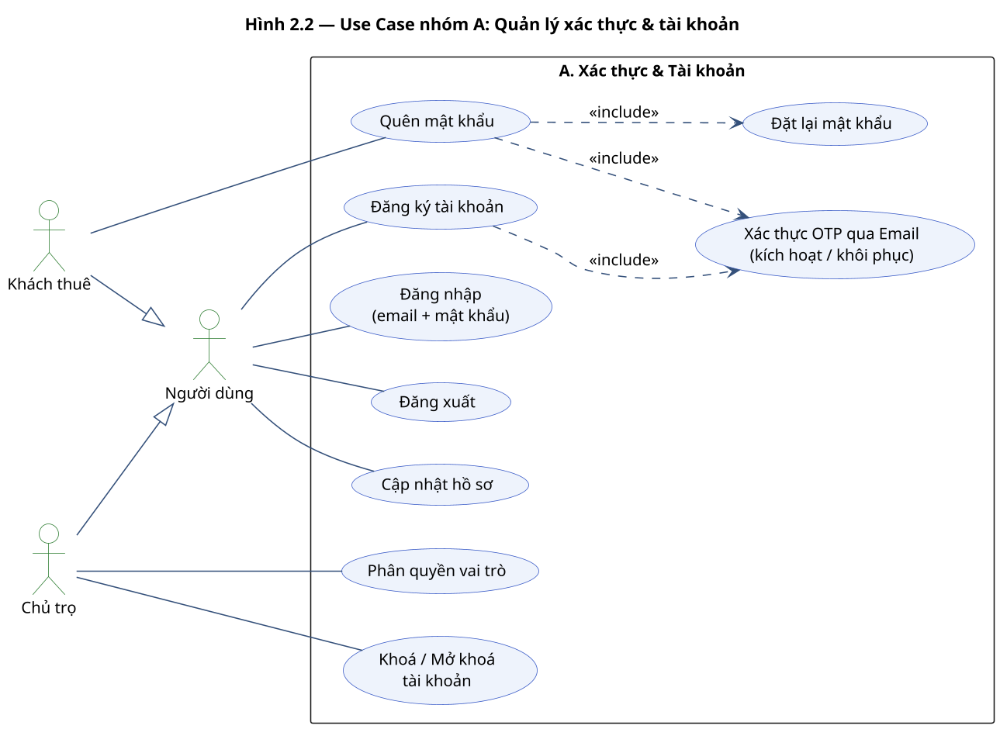
```plantuml
@startuml UC_Auth
title Hình 2.2 — Use Case nhóm A: Quản lý xác thực & tài khoản

skinparam dpi 150
skinparam shadowing false
skinparam defaultFontName "Segoe UI"
skinparam defaultFontSize 13
skinparam packageStyle rectangle
skinparam ArrowColor #34507A
skinparam usecase {
  BackgroundColor #EEF3FC
  BorderColor #3A5BC7
}
skinparam actor {
  BackgroundColor #FFFFFF
  BorderColor #2E7D32
}
left to right direction

actor "Người dùng" as User
actor "Khách thuê" as Tenant
actor "Chủ trọ"    as Owner

rectangle "A. Xác thực & Tài khoản" {
  usecase "Đăng ký tài khoản"            as U1
  usecase "Đăng nhập\n(email + mật khẩu)" as U2
  usecase "Đăng xuất"                     as U3
  usecase "Quên mật khẩu"                 as U4
  usecase "Đặt lại mật khẩu"              as U5
  usecase "Cập nhật hồ sơ"                as U6
  usecase "Khoá / Mở khoá\ntài khoản"     as U7
  usecase "Phân quyền vai trò"            as U8
  usecase "Xác thực OTP qua Email\n(kích hoạt / khôi phục)" as OTP
}

' Kế thừa: Khách thuê và Chủ trọ đều là Người dùng
' (dùng chung Đăng ký / Đăng nhập / Đăng xuất / Cập nhật hồ sơ)
Tenant --|> User
Owner  --|> User

User -- U1
User -- U2
User -- U3
User -- U6
Tenant -- U4
Owner -- U7
Owner -- U8

U1 ..> OTP : <<include>>
U4 ..> OTP : <<include>>
U4 ..> U5  : <<include>>

@enduml
```

## 2.03_uc_room.puml

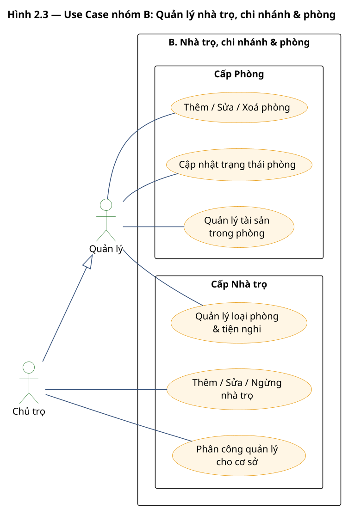
```plantuml
@startuml UC_Room
title Hình 2.3 — Use Case nhóm B: Quản lý nhà trọ, chi nhánh & phòng

skinparam dpi 150
skinparam shadowing false
skinparam defaultFontName "Segoe UI"
skinparam defaultFontSize 13
skinparam packageStyle rectangle
skinparam ArrowColor #34507A
skinparam usecase {
  BackgroundColor #FFF6E5
  BorderColor #E59300
}
skinparam actor {
  BackgroundColor #FFFFFF
  BorderColor #2E7D32
}
left to right direction

actor "Chủ trọ"  as Owner
actor "Quản lý"  as Manager

rectangle "B. Nhà trọ, chi nhánh & phòng" {
  package "Cấp Nhà trọ" {
    usecase "Thêm / Sửa / Ngừng\nnhà trọ"      as R1
    usecase "Phân công quản lý\ncho cơ sở"     as R2
    usecase "Quản lý loại phòng\n& tiện nghi"  as R3
  }
  package "Cấp Phòng" {
    usecase "Thêm / Sửa / Xoá phòng"           as R4
    usecase "Cập nhật trạng thái phòng"        as R5
    usecase "Quản lý tài sản\ntrong phòng"     as R6
  }
}

' Kế thừa: Chủ trọ có toàn bộ chức năng của Quản lý,
' thêm quyền riêng ở cấp Nhà trọ (thêm/ngừng cơ sở, phân công)
Owner --|> Manager
Owner -- R1
Owner -- R2
Manager -- R3
Manager -- R4
Manager -- R5
Manager -- R6

@enduml
```

## 2.04_uc_contract.puml

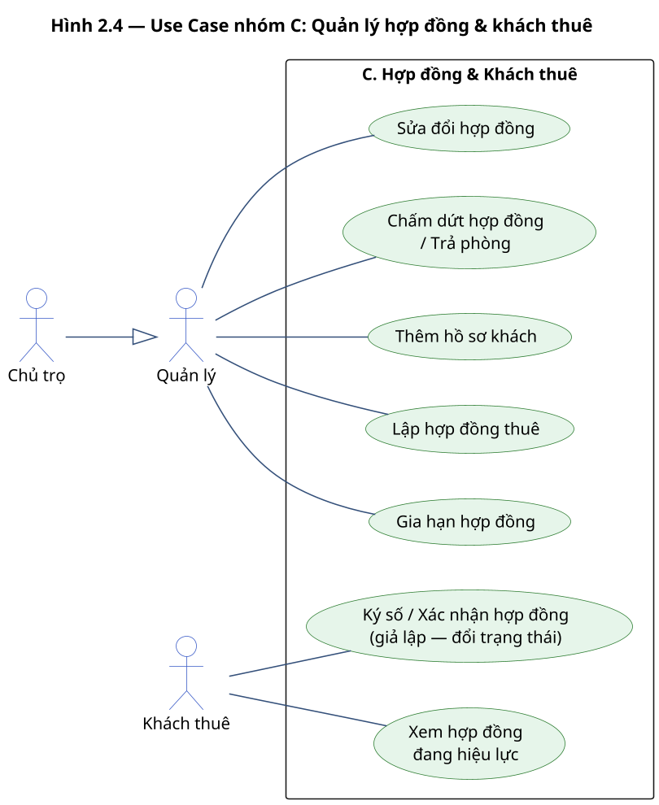
```plantuml
@startuml UC_Contract
title Hình 2.4 — Use Case nhóm C: Quản lý hợp đồng & khách thuê

skinparam dpi 150
skinparam shadowing false
skinparam defaultFontName "Segoe UI"
skinparam defaultFontSize 13
skinparam packageStyle rectangle
skinparam ArrowColor #34507A
skinparam usecase {
  BackgroundColor #E6F5EA
  BorderColor #2E7D32
}
skinparam actor {
  BackgroundColor #FFFFFF
  BorderColor #3A5BC7
}
left to right direction

actor "Chủ trọ"     as Owner
actor "Quản lý"     as Manager
actor "Khách thuê"  as Tenant

rectangle "C. Hợp đồng & Khách thuê" {
  usecase "Thêm hồ sơ khách"            as C1
  usecase "Lập hợp đồng thuê"           as C2
  usecase "Ký số / Xác nhận hợp đồng\n(giả lập — đổi trạng thái)" as C3
  usecase "Gia hạn hợp đồng"            as C4
  usecase "Sửa đổi hợp đồng"            as C5
  usecase "Chấm dứt hợp đồng\n/ Trả phòng" as C6
  usecase "Xem hợp đồng\nđang hiệu lực"        as C7
}

' Kế thừa: Chủ trọ dùng chung toàn bộ chức năng hợp đồng với Quản lý
Owner --|> Manager
Manager -- C1
Manager -- C2
Manager -- C4
Manager -- C5
Manager -- C6
Tenant  -- C3
Tenant  -- C7

@enduml
```

## 2.05_uc_billing.puml

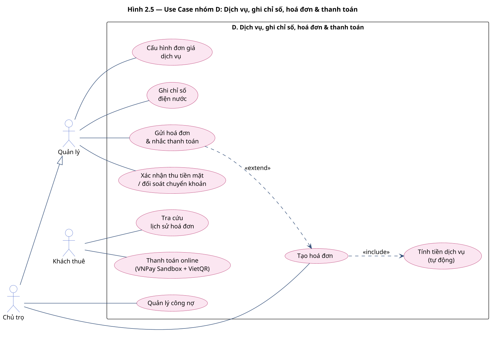
```plantuml
@startuml UC_Billing
title Hình 2.5 — Use Case nhóm D: Dịch vụ, ghi chỉ số, hoá đơn & thanh toán

skinparam dpi 150
skinparam shadowing false
skinparam defaultFontName "Segoe UI"
skinparam defaultFontSize 13
skinparam packageStyle rectangle
skinparam ArrowColor #34507A
skinparam usecase {
  BackgroundColor #FBE6F1
  BorderColor #AD1457
}
skinparam actor {
  BackgroundColor #FFFFFF
  BorderColor #3A5BC7
}
left to right direction

actor "Chủ trọ"     as Owner
actor "Quản lý"     as Manager
actor "Khách thuê"  as Tenant

rectangle "D. Dịch vụ, ghi chỉ số, hoá đơn & thanh toán" {
  usecase "Cấu hình đơn giá\ndịch vụ"      as B1
  usecase "Ghi chỉ số\nđiện nước"          as B2
  usecase "Tính tiền dịch vụ\n(tự động)"   as B3
  usecase "Tạo hoá đơn"                    as B4
  usecase "Gửi hoá đơn\n& nhắc thanh toán" as B5
  usecase "Thanh toán online\n(VNPay Sandbox + VietQR)" as B6
  usecase "Xác nhận thu tiền mặt\n/ đối soát chuyển khoản" as B7
  usecase "Tra cứu\nlịch sử hoá đơn"       as B8
  usecase "Quản lý công nợ"                as B9
}

' Kế thừa: Chủ trọ có toàn bộ chức năng của Quản lý,
' thêm 2 quyền riêng: Tạo hoá đơn (B4) và Quản lý công nợ (B9)
Owner --|> Manager
Owner   -- B4
Owner   -- B9
' Quản lý: dịch vụ, ghi chỉ số, nhắc nợ, xác nhận thu tiền
Manager -- B1
Manager -- B2
Manager -- B5
Manager -- B7
' Khách thuê: thanh toán & tra cứu
Tenant  -- B6
Tenant  -- B8

' Khi tạo hoá đơn, hệ thống tự tính tiền dịch vụ bên trong
B4 ..> B3 : <<include>>
' Nhắc thanh toán là bước mở rộng (tuỳ chọn) sau khi đã có hoá đơn
B5 ..> B4 : <<extend>>

@enduml
```

## 2.06_uc_report.puml

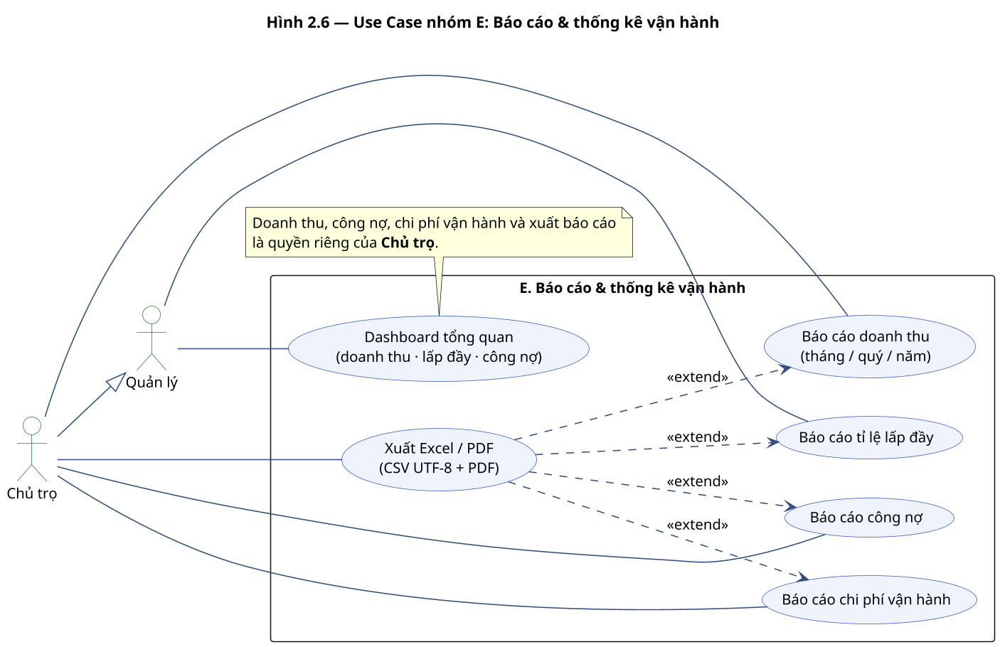
```plantuml
@startuml UC_Report
title Hình 2.6 — Use Case nhóm E: Báo cáo & thống kê vận hành

skinparam dpi 150
skinparam shadowing false
skinparam defaultFontName "Segoe UI"
skinparam defaultFontSize 13
skinparam packageStyle rectangle
skinparam ArrowColor #34507A
skinparam usecase {
  BackgroundColor #EEF3FC
  BorderColor #3A5BC7
}
skinparam actor {
  BackgroundColor #FFFFFF
  BorderColor #2E7D32
}
left to right direction

actor "Chủ trọ" as Owner
actor "Quản lý" as Manager

rectangle "E. Báo cáo & thống kê vận hành" {
  usecase "Dashboard tổng quan\n(doanh thu · lấp đầy · công nợ)" as E1
  usecase "Báo cáo doanh thu\n(tháng / quý / năm)"  as E2
  usecase "Báo cáo tỉ lệ lấp đầy" as E3
  usecase "Báo cáo công nợ"        as E4
  usecase "Báo cáo chi phí vận hành" as E5
  usecase "Xuất Excel / PDF\n(CSV UTF-8 + PDF)" as E6
}

' Kế thừa: Chủ trọ xem được mọi báo cáo của Quản lý,
' thêm 4 quyền riêng: doanh thu, công nợ, chi phí, xuất file
Owner --|> Manager
Owner -- E2
Owner -- E4
Owner -- E5
Owner -- E6
' Quản lý chỉ xem Dashboard và tỉ lệ lấp đầy của cơ sở mình phụ trách
Manager -- E1
Manager -- E3

' Xuất file là bước mở rộng (tuỳ chọn) của từng báo cáo
E6 ..> E2 : <<extend>>
E6 ..> E3 : <<extend>>
E6 ..> E4 : <<extend>>
E6 ..> E5 : <<extend>>

note bottom of E1
  Doanh thu, công nợ, chi phí vận hành và xuất báo cáo
  là quyền riêng của **Chủ trọ**.
end note

@enduml
```

## 2.06b_uc_utilities.puml

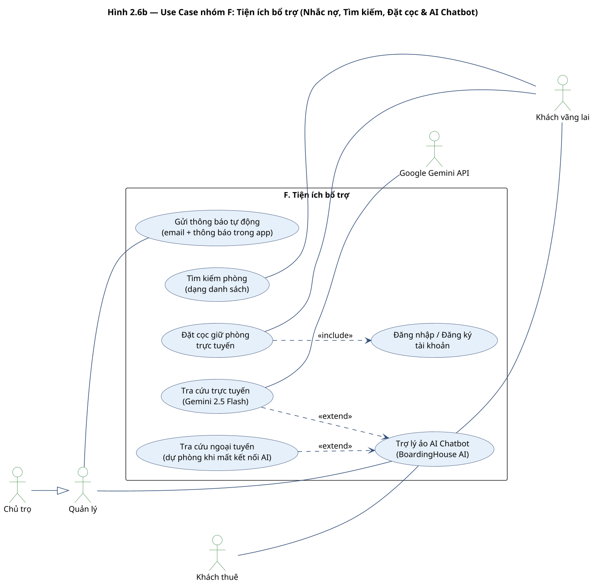
```plantuml
@startuml UC_Utilities
title Hình 2.6b — Use Case nhóm F: Tiện ích bổ trợ (Nhắc nợ, Tìm kiếm, Đặt cọc & AI Chatbot)

skinparam dpi 150
skinparam shadowing false
skinparam defaultFontName "Segoe UI"
skinparam defaultFontSize 13
skinparam packageStyle rectangle
skinparam ArrowColor #34507A
skinparam usecase {
  BackgroundColor #E6F0FA
  BorderColor #1F3864
}
skinparam actor {
  BackgroundColor #FFFFFF
  BorderColor #2E7D32
}
left to right direction

actor "Chủ trọ"        as Owner
actor "Quản lý"        as Manager
actor "Khách thuê"     as Tenant
actor "Khách vãng lai" as Visitor
actor "Google Gemini API" as Gemini

rectangle "F. Tiện ích bổ trợ" {
  usecase "Gửi thông báo tự động\n(email + thông báo trong app)" as F1
  usecase "Tìm kiếm phòng\n(dạng danh sách)"  as F2
  usecase "Đặt cọc giữ phòng\ntrực tuyến"     as F3
  usecase "Trợ lý ảo AI Chatbot\n(BoardingHouse AI)" as F4
  usecase "Đăng nhập / Đăng ký\ntài khoản"           as FA
  usecase "Tra cứu trực tuyến\n(Gemini 2.5 Flash)"   as F5
  usecase "Tra cứu ngoại tuyến\n(dự phòng khi mất kết nối AI)" as F6
}

' Kế thừa: Chủ trọ dùng chung các tiện ích với Quản lý
Owner --|> Manager
Manager -- F1
Manager -- F4
Tenant  -- F4

' Tìm kiếm & Đặt cọc thuộc hành trình Khách vãng lai (public), không nằm trong phân hệ Khách thuê
F2 -- Visitor
F3 -- Visitor

' Chatbot mở công khai cho mọi đối tượng — kể cả Khách vãng lai chưa đăng nhập
F4 -- Visitor

' Riêng Đặt cọc bắt buộc có tài khoản đã đăng nhập
F3 ..> FA : <<include>>

' Hai chế độ tra cứu là phần mở rộng của Chatbot
F5 ..> F4 : <<extend>>
F6 ..> F4 : <<extend>>
F5 -- Gemini

@enduml
```

## 2.07_act_register_otp.puml

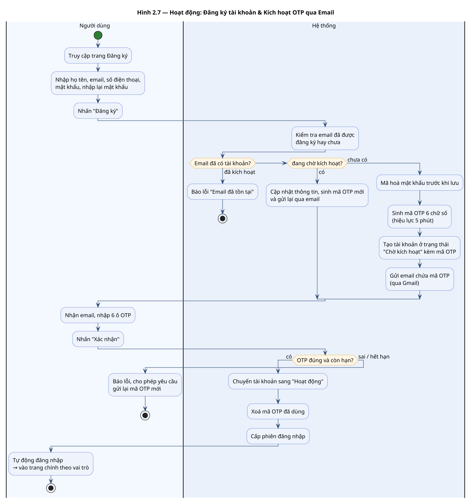
```plantuml
@startuml Act_Register_OTP
title Hình 2.7 — Hoạt động: Đăng ký tài khoản & Kích hoạt OTP qua Email

skinparam dpi 150
skinparam shadowing false
skinparam defaultFontName "Segoe UI"
skinparam defaultFontSize 13
skinparam ArrowColor #34507A
skinparam activity {
  BackgroundColor #EEF3FC
  BorderColor #3A5BC7
  DiamondBackgroundColor #FFF6E5
  DiamondBorderColor #E59300
  StartColor #2E7D32
  EndColor #AD1457
}

|#F4F8FF|Người dùng|
start
:Truy cập trang Đăng ký;
:Nhập họ tên, email, số điện thoại,\nmật khẩu, nhập lại mật khẩu;
:Nhấn "Đăng ký";

|#EAF1FB|Hệ thống|
:Kiểm tra email đã được\nđăng ký hay chưa;
if (Email đã có tài khoản?) then (đã kích hoạt)
  :Báo lỗi "Email đã tồn tại";
  stop
elseif (đang chờ kích hoạt?) then (có)
  :Cập nhật thông tin, sinh mã OTP mới\nvà gửi lại qua email;
else (chưa có)
  :Mã hoá mật khẩu trước khi lưu;
  :Sinh mã OTP 6 chữ số\n(hiệu lực 5 phút);
  :Tạo tài khoản ở trạng thái\n"Chờ kích hoạt" kèm mã OTP;
  :Gửi email chứa mã OTP\n(qua Gmail);
endif

|Người dùng|
:Nhận email, nhập 6 ô OTP;
:Nhấn "Xác nhận";

|Hệ thống|
if (OTP đúng và còn hạn?) then (có)
  :Chuyển tài khoản sang "Hoạt động";
  :Xoá mã OTP đã dùng;
  :Cấp phiên đăng nhập;
  |Người dùng|
  :Tự động đăng nhập\n→ vào trang chính theo vai trò;
  stop
else (sai / hết hạn)
  :Báo lỗi, cho phép yêu cầu\ngửi lại mã OTP mới;
  stop
endif

@enduml
```

## 2.08_act_room.puml

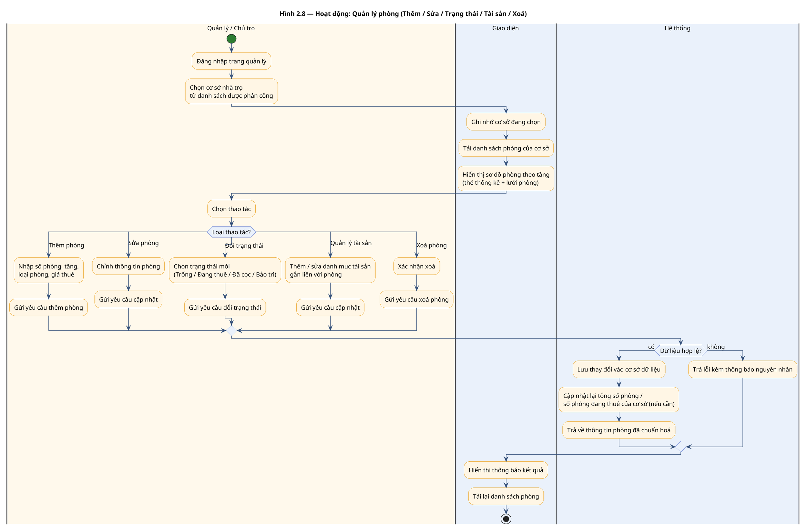
```plantuml
@startuml Act_Room
title Hình 2.8 — Hoạt động: Quản lý phòng (Thêm / Sửa / Trạng thái / Tài sản / Xoá)

skinparam dpi 150
skinparam shadowing false
skinparam defaultFontName "Segoe UI"
skinparam defaultFontSize 13
skinparam ArrowColor #34507A
skinparam activity {
  BackgroundColor #FFF6E5
  BorderColor #E59300
  DiamondBackgroundColor #EAF1FB
  DiamondBorderColor #3A5BC7
  StartColor #2E7D32
  EndColor #AD1457
}

|#FFF9EC|Quản lý / Chủ trọ|
start
:Đăng nhập trang quản lý;
:Chọn cơ sở nhà trọ\ntừ danh sách được phân công;

|#EAF1FB|Giao diện|
:Ghi nhớ cơ sở đang chọn;
:Tải danh sách phòng của cơ sở;
:Hiển thị sơ đồ phòng theo tầng\n(thẻ thống kê + lưới phòng);

|Quản lý / Chủ trọ|
:Chọn thao tác;
switch (Loại thao tác?)
case (Thêm phòng)
  :Nhập số phòng, tầng,\nloại phòng, giá thuê;
  :Gửi yêu cầu thêm phòng;
case (Sửa phòng)
  :Chỉnh thông tin phòng;
  :Gửi yêu cầu cập nhật;
case (Đổi trạng thái)
  :Chọn trạng thái mới\n(Trống / Đang thuê / Đã cọc / Bảo trì);
  :Gửi yêu cầu đổi trạng thái;
case (Quản lý tài sản)
  :Thêm / sửa danh mục tài sản\ngắn liền với phòng;
  :Gửi yêu cầu cập nhật;
case (Xoá phòng)
  :Xác nhận xoá;
  :Gửi yêu cầu xoá phòng;
endswitch

|#EAF1FB|Hệ thống|
if (Dữ liệu hợp lệ?) then (có)
  :Lưu thay đổi vào cơ sở dữ liệu;
  :Cập nhật lại tổng số phòng /\nsố phòng đang thuê của cơ sở (nếu cần);
  :Trả về thông tin phòng đã chuẩn hoá;
else (không)
  :Trả lỗi kèm thông báo nguyên nhân;
endif

|Giao diện|
:Hiển thị thông báo kết quả;
:Tải lại danh sách phòng;
stop

@enduml
```

## 2.09_act_contract_sign.puml

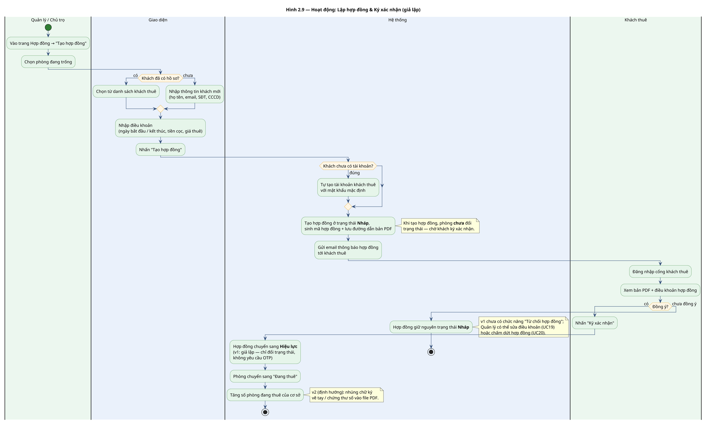
```plantuml
@startuml Act_Contract_Sign
title Hình 2.9 — Hoạt động: Lập hợp đồng & Ký xác nhận (giả lập)

skinparam dpi 150
skinparam shadowing false
skinparam defaultFontName "Segoe UI"
skinparam defaultFontSize 13
skinparam ArrowColor #34507A
skinparam activity {
  BackgroundColor #E6F5EA
  BorderColor #2E7D32
  DiamondBackgroundColor #FFF6E5
  DiamondBorderColor #E59300
  StartColor #2E7D32
  EndColor #AD1457
}

|#ECF7EF|Quản lý / Chủ trọ|
start
:Vào trang Hợp đồng → "Tạo hợp đồng";
:Chọn phòng đang trống;

|#EAF1FB|Giao diện|
if (Khách đã có hồ sơ?) then (có)
  :Chọn từ danh sách khách thuê;
else (chưa)
  :Nhập thông tin khách mới\n(họ tên, email, SĐT, CCCD);
endif
:Nhập điều khoản\n(ngày bắt đầu / kết thúc, tiền cọc, giá thuê);
:Nhấn "Tạo hợp đồng";

|#EAF1FB|Hệ thống|
if (Khách chưa có tài khoản?) then (đúng)
  :Tự tạo tài khoản khách thuê\nvới mật khẩu mặc định;
endif
:Tạo hợp đồng ở trạng thái **Nháp**,\nsinh mã hợp đồng + lưu đường dẫn bản PDF;
note right
  Khi tạo hợp đồng, phòng **chưa** đổi
  trạng thái — chờ khách ký xác nhận.
end note
:Gửi email thông báo hợp đồng\ntới khách thuê;

|#ECF7EF|Khách thuê|
:Đăng nhập cổng khách thuê;
:Xem bản PDF + điều khoản hợp đồng;
if (Đồng ý?) then (có)
  :Nhấn "Ký xác nhận";
  |#EAF1FB|Hệ thống|
  :Hợp đồng chuyển sang **Hiệu lực**\n(v1: giả lập — chỉ đổi trạng thái,\nkhông yêu cầu OTP);
  :Phòng chuyển sang "Đang thuê";
  :Tăng số phòng đang thuê của cơ sở;
  note right
    v2 (định hướng): nhúng chữ ký
    vẽ tay / chứng thư số vào file PDF.
  end note
  stop
else (chưa đồng ý)
  :Hợp đồng giữ nguyên trạng thái **Nháp**;
  note right
    v1 chưa có chức năng "Từ chối hợp đồng";
    Quản lý có thể sửa điều khoản (UC19)
    hoặc chấm dứt hợp đồng (UC20).
  end note
  stop
endif

@enduml
```

## 2.10_act_meter_invoice.puml

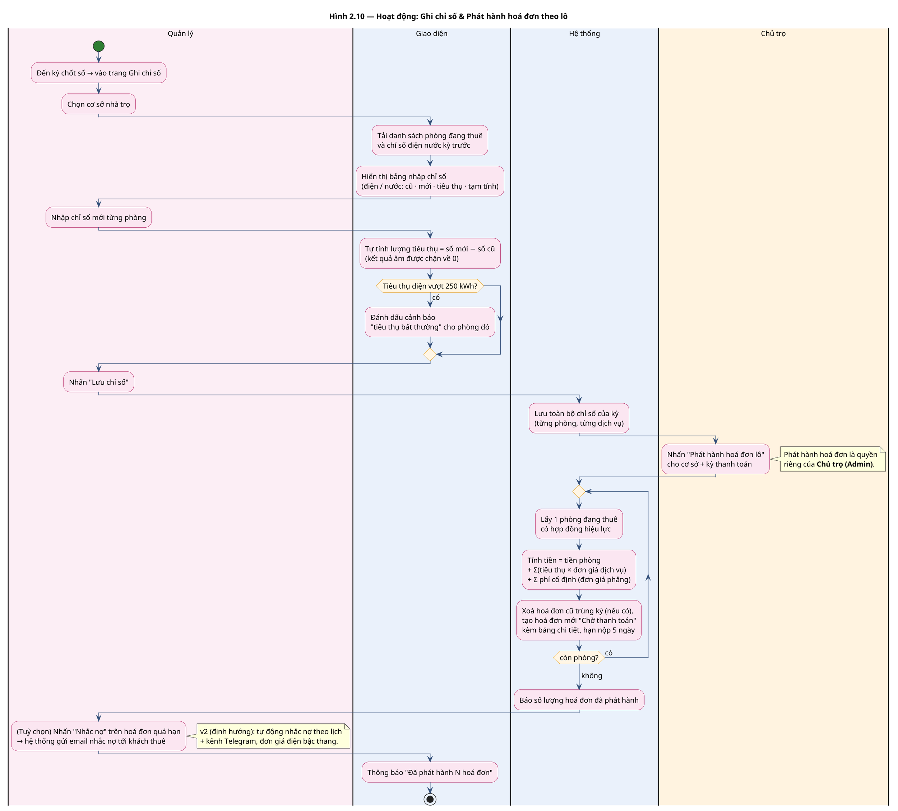
```plantuml
@startuml Act_Meter_Invoice
title Hình 2.10 — Hoạt động: Ghi chỉ số & Phát hành hoá đơn theo lô

skinparam dpi 150
skinparam shadowing false
skinparam defaultFontName "Segoe UI"
skinparam defaultFontSize 13
skinparam ArrowColor #34507A
skinparam activity {
  BackgroundColor #FBE6F1
  BorderColor #AD1457
  DiamondBackgroundColor #FFF6E5
  DiamondBorderColor #E59300
  StartColor #2E7D32
  EndColor #AD1457
}

|#FCEEF5|Quản lý|
start
:Đến kỳ chốt số → vào trang Ghi chỉ số;
:Chọn cơ sở nhà trọ;

|#EAF1FB|Giao diện|
:Tải danh sách phòng đang thuê\nvà chỉ số điện nước kỳ trước;
:Hiển thị bảng nhập chỉ số\n(điện / nước: cũ · mới · tiêu thụ · tạm tính);

|Quản lý|
:Nhập chỉ số mới từng phòng;

|#EAF1FB|Giao diện|
:Tự tính lượng tiêu thụ = số mới − số cũ\n(kết quả âm được chặn về 0);
if (Tiêu thụ điện vượt 250 kWh?) then (có)
  :Đánh dấu cảnh báo\n"tiêu thụ bất thường" cho phòng đó;
endif

|Quản lý|
:Nhấn "Lưu chỉ số";
|#EAF1FB|Hệ thống|
:Lưu toàn bộ chỉ số của kỳ\n(từng phòng, từng dịch vụ);

|#FFF3E0|Chủ trọ|
:Nhấn "Phát hành hoá đơn lô"\ncho cơ sở + kỳ thanh toán;
note right
  Phát hành hoá đơn là quyền
  riêng của **Chủ trọ (Admin)**.
end note
|#EAF1FB|Hệ thống|
repeat
  :Lấy 1 phòng đang thuê\ncó hợp đồng hiệu lực;
  :Tính tiền = tiền phòng\n+ Σ(tiêu thụ × đơn giá dịch vụ)\n+ Σ phí cố định (đơn giá phẳng);
  :Xoá hoá đơn cũ trùng kỳ (nếu có),\ntạo hoá đơn mới "Chờ thanh toán"\nkèm bảng chi tiết, hạn nộp 5 ngày;
repeat while (còn phòng?) is (có)
->không;
:Báo số lượng hoá đơn đã phát hành;

|Quản lý|
:(Tuỳ chọn) Nhấn "Nhắc nợ" trên hoá đơn quá hạn\n→ hệ thống gửi email nhắc nợ tới khách thuê;
note right
  v2 (định hướng): tự động nhắc nợ theo lịch
  + kênh Telegram, đơn giá điện bậc thang.
end note

|Giao diện|
:Thông báo "Đã phát hành N hoá đơn";
stop

@enduml
```

## 2.11_act_payment.puml

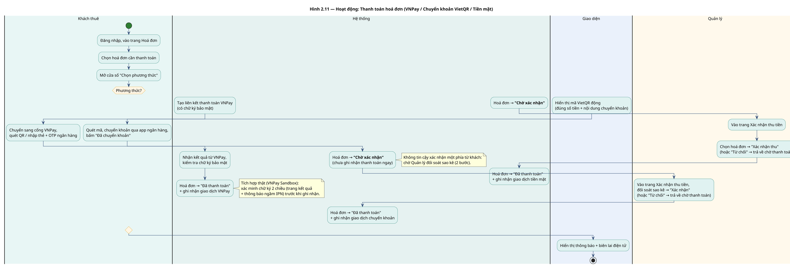
```plantuml
@startuml Act_Payment
title Hình 2.11 — Hoạt động: Thanh toán hoá đơn (VNPay / Chuyển khoản VietQR / Tiền mặt)

skinparam dpi 150
skinparam shadowing false
skinparam defaultFontName "Segoe UI"
skinparam defaultFontSize 13
skinparam ArrowColor #34507A
skinparam activity {
  BackgroundColor #E0F2F1
  BorderColor #00695C
  DiamondBackgroundColor #FFF6E5
  DiamondBorderColor #E59300
  StartColor #2E7D32
  EndColor #AD1457
}

|#E8F6F5|Khách thuê|
start
:Đăng nhập, vào trang Hoá đơn;
:Chọn hoá đơn cần thanh toán;
:Mở cửa sổ "Chọn phương thức";

switch (Phương thức?)
case (Ví VNPay)
  |#E6F2F1|Hệ thống|
  :Tạo liên kết thanh toán VNPay\n(có chữ ký bảo mật);
  |#E8F6F5|Khách thuê|
  :Chuyển sang cổng VNPay,\nquét QR / nhập thẻ + OTP ngân hàng;
  |#E6F2F1|Hệ thống|
  :Nhận kết quả từ VNPay,\nkiểm tra chữ ký bảo mật;
  :Hoá đơn → "Đã thanh toán"\n+ ghi nhận giao dịch VNPay;
  note right
    Tích hợp thật (VNPay Sandbox):
    xác minh chữ ký 2 chiều (trang kết quả
    + thông báo ngầm IPN) trước khi ghi nhận.
  end note
case (Chuyển khoản — VietQR)
  |#EAF1FB|Giao diện|
  :Hiển thị mã VietQR động\n(đúng số tiền + nội dung chuyển khoản);
  |#E8F6F5|Khách thuê|
  :Quét mã, chuyển khoản qua app ngân hàng,\nbấm "Đã chuyển khoản";
  |#E6F2F1|Hệ thống|
  :Hoá đơn → **"Chờ xác nhận"**\n(chưa ghi nhận thanh toán ngay);
  note right
    Không tin cậy xác nhận một phía từ khách:
    chờ Quản lý đối soát sao kê (2 bước).
  end note
  |#FFF9EC|Quản lý|
  :Vào trang Xác nhận thu tiền,\nđối soát sao kê → "Xác nhận"\n(hoặc "Từ chối" → trả về chờ thanh toán);
  |#E6F2F1|Hệ thống|
  :Hoá đơn → "Đã thanh toán"\n+ ghi nhận giao dịch chuyển khoản;
case (Tiền mặt)
  |#E6F2F1|Hệ thống|
  :Hoá đơn → **"Chờ xác nhận"**;
  |#FFF9EC|Quản lý|
  :Vào trang Xác nhận thu tiền;
  :Chọn hoá đơn → "Xác nhận thu"\n(hoặc "Từ chối" → trả về chờ thanh toán);
  |#E6F2F1|Hệ thống|
  :Hoá đơn → "Đã thanh toán"\n+ ghi nhận giao dịch tiền mặt;
endswitch

|#EAF1FB|Giao diện|
:Hiển thị thông báo + biên lai điện tử;
stop

@enduml
```

## 2.12_class_diagram.puml

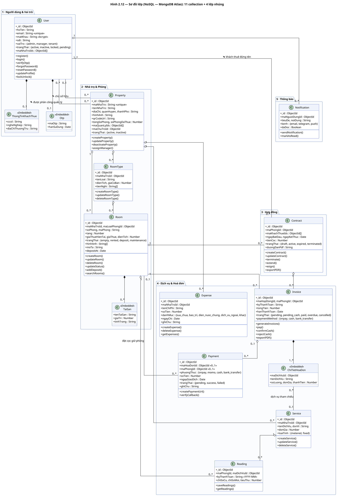
```plantuml
@startuml ClassDiagram
title Hình 2.12 — Sơ đồ lớp (NoSQL — MongoDB Atlas): 11 collection + 4 lớp nhúng

skinparam dpi 150
skinparam shadowing false
skinparam defaultFontName "Segoe UI"
skinparam defaultFontSize 12
skinparam classAttributeIconSize 0
skinparam linetype ortho
skinparam class {
  BackgroundColor #FFFFFF
  BorderColor #3A5BC7
  HeaderBackgroundColor #EEF3FC
}
skinparam package {
  BackgroundColor #FBFCFE
  BorderColor #9DB2D6
}

package "1 · Người dùng & Vai trò" {
  class User {
    +_id : ObjectId
    +hoTen : String
    +email : String <<unique>>
    +matKhau : String <<bcrypt>>
    +sdt : String
    +vaiTro : {admin, manager, tenant}
    +trangThai : {active, inactive, locked, pending}
    +maNhaTroIds : ObjectId[]
    --
    +register()
    +login()
    +verifyOtp()
    +forgotPassword()
    +resetPassword()
    +updateProfile()
    +lockUnlock()
  }
  class ThongTinKhachThue <<Embedded>> {
    +cccd : String
    +ngheNghiep : String
    +diaChiThuongTru : String
  }
  class Otp <<Embedded>> {
    +maOtp : String
    +hanSuDung : Date
  }
  User *-- "0..1" ThongTinKhachThue
  User *-- "0..1" Otp
}

package "2 · Nhà trọ & Phòng" {
  class Property {
    +_id : ObjectId
    +maNhaTro : String <<unique>>
    +tenNhaTro : String
    +diaChi, quanHuyen, thanhPho : String
    +hinhAnh : String
    +qrCodeUrl : String
    +tongSoPhong, soPhongDaThue : Number
    +maQuanLyIds : ObjectId[]
    +maChuTroId : ObjectId
    +trangThai : {active, inactive}
    --
    +createProperty()
    +updateProperty()
    +deactivateProperty()
    +assignManager()
  }
  class RoomType {
    +_id : ObjectId
    +maNhaTroId : ObjectId
    +tenLoai : String
    +dienTich, giaCoBan : Number
    +tienNghi : String[]
    --
    +createRoomType()
    +updateRoomType()
    +deleteRoomType()
  }
  class Room {
    +_id : ObjectId
    +maNhaTroId, maLoaiPhongId : ObjectId
    +soPhong, maPhong : String
    +tang : Number
    +giaThueHienTai, giaThue, dienTich : Number
    +trangThai : {empty, rented, deposit, maintenance}
    +hinhAnh : String[]
    +moTa : String
    +depositAt : Date
    --
    +createRoom()
    +updateRoom()
    +deleteRoom()
    +updateStatus()
    +addDeposit()
    +searchRooms()
  }
  class TaiSan <<Embedded>> {
    +tenTaiSan : String
    +giaTri : Number
    +tinhTrang : String
  }
  Property "1" o-- "0..*" RoomType
  Property "1" o-- "0..*" Room
  RoomType "1" o-- "0..*" Room
  Room *-- "0..*" TaiSan
}

package "3 · Hợp đồng" {
  class Contract {
    +_id : ObjectId
    +maPhongId : ObjectId
    +maKhachThueIds : ObjectId[]
    +ngayBatDau, ngayKetThuc : Date
    +tienCoc : Number
    +trangThai : {draft, active, expired, terminated}
    +duongDanPdf : String
    --
    +createContract()
    +updateContract()
    +terminate()
    +extend()
    +esign()
    +exportPDF()
  }
  Room "1" o-- "0..*" Contract
}

package "4 · Dịch vụ & Hoá đơn" {
  class Service {
    +_id : ObjectId
    +maNhaTroId : ObjectId
    +tenDichVu, donVi : String
    +donGia : Number
    +loaiTinh : {metered, fixed}
    --
    +createService()
    +updateService()
    +deleteService()
  }
  class Reading {
    +_id : ObjectId
    +maPhongId, maDichVuId : ObjectId
    +kyThanhToan : String <<YYYY-MM>>
    +chiSoCu, chiSoMoi, tieuThu : Number
    --
    +saveReadings()
    +getReadings()
  }
  class Invoice {
    +_id : ObjectId
    +maHopDongId, maPhongId : ObjectId
    +kyThanhToan : String
    +tongTien : Number
    +hanThanhToan : Date
    +trangThai : {pending, pending_cash, paid, overdue, cancelled}
    +paymentMethod : {vnpay, cash, bank_transfer}
    --
    +generateInvoices()
    +pay()
    +confirmCash()
    +rejectCash()
    +exportPDF()
  }
  class ChiTietHoaDon <<Embedded>> {
    +maDichVuId : ObjectId
    +tenDichVu : String
    +soLuong, donGia, thanhTien : Number
  }
  class Payment {
    +_id : ObjectId
    +maHoaDonId : ObjectId <<0..1>>
    +maPhongId : ObjectId <<0..1>>
    +phuongThuc : {vnpay, momo, cash, bank_transfer}
    +soTien : Number
    +ngayGiaoDich : Date
    +trangThai : {pending, success, failed}
    +ghiChu : String
    --
    +createPaymentUrl()
    +verifyCallback()
  }
  class Expense {
    +_id : ObjectId
    +maNhaTroId : ObjectId
    +tenChiPhi : String
    +soTien : Number
    +danhMuc : {sua_chua, bao_tri, dien_nuoc_chung, dich_vu_ngoai, khac}
    +ngayChi : Date
    +ghiChu : String
    --
    +createExpense()
    +deleteExpense()
    +getExpenses()
  }
  Property "1" o-- "0..*" Service
  Property "1" o-- "0..*" Expense
  Room "1" o-- "0..*" Reading
  Service "1" o-- "0..*" Reading
  Contract "1" o-- "0..*" Invoice
  Room "1" -- "0..*" Invoice
  Invoice *-- "1..*" ChiTietHoaDon
  ChiTietHoaDon "0..*" -- "0..1" Service : dịch vụ tham chiếu
  Invoice "0..1" o-- "0..*" Payment
  Room "0..1" -- "0..*" Payment : đặt cọc giữ phòng
}

package "5 · Thông báo" {
  class Notification {
    +_id : ObjectId
    +maNguoiDungId : ObjectId
    +tieuDe, noiDung : String
    +kenh : {email, telegram, push}
    +daDoc : Boolean
    --
    +sendNotification()
    +markAsRead()
  }
  User "1" o-- "0..*" Notification
}

' ══ Quan hệ liên gói với Người dùng ══
Contract "0..*" -- "1..*" User : khách thuê đứng tên >
User "0..1" -- "0..*" Property : chủ sở hữu >
User "0..*" -- "0..*" Property : được phân công quản lý >

@enduml
```

## 2.13_seq_register_otp.puml

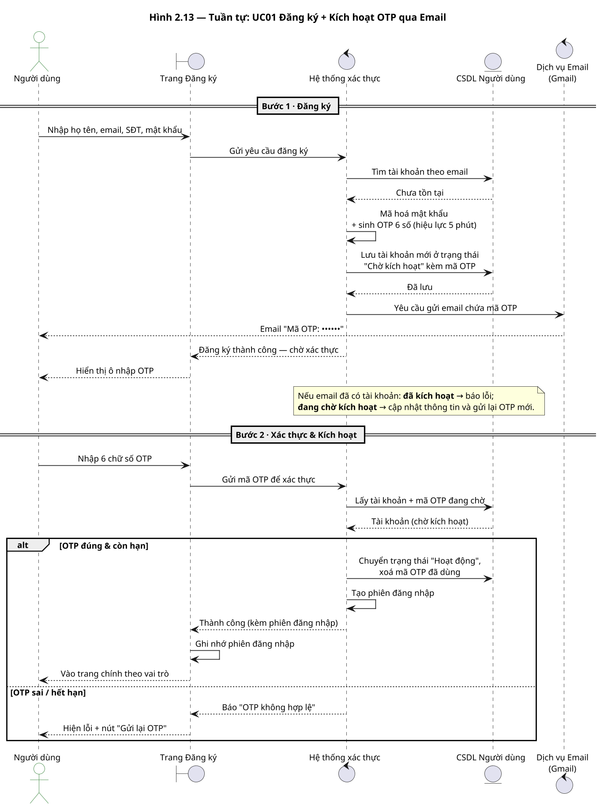
```plantuml
@startuml Seq_Register_OTP
title Hình 2.13 — Tuần tự: UC01 Đăng ký + Kích hoạt OTP qua Email

skinparam dpi 150
skinparam shadowing false
skinparam defaultFontName "Segoe UI"
skinparam defaultFontSize 12
skinparam sequenceMessageAlign center
skinparam ParticipantBackgroundColor #EEF3FC
skinparam ParticipantBorderColor #3A5BC7
skinparam ActorBackgroundColor #FFFFFF
skinparam ActorBorderColor #2E7D32

actor    "Người dùng"        as User
boundary "Trang Đăng ký"     as UI
control  "Hệ thống xác thực" as Auth
entity   "CSDL Người dùng"   as DB
control  "Dịch vụ Email\n(Gmail)" as Mail

== Bước 1 · Đăng ký ==
User -> UI : Nhập họ tên, email, SĐT, mật khẩu
UI -> Auth : Gửi yêu cầu đăng ký
Auth -> DB : Tìm tài khoản theo email
DB --> Auth : Chưa tồn tại
Auth -> Auth : Mã hoá mật khẩu\n+ sinh OTP 6 số (hiệu lực 5 phút)
Auth -> DB : Lưu tài khoản mới ở trạng thái\n"Chờ kích hoạt" kèm mã OTP
DB --> Auth : Đã lưu
Auth -> Mail : Yêu cầu gửi email chứa mã OTP
Mail --> User : Email "Mã OTP: ••••••"
Auth --> UI : Đăng ký thành công — chờ xác thực
UI --> User : Hiển thị ô nhập OTP

note over Auth, DB
  Nếu email đã có tài khoản: **đã kích hoạt** → báo lỗi;
  **đang chờ kích hoạt** → cập nhật thông tin và gửi lại OTP mới.
end note

== Bước 2 · Xác thực & Kích hoạt ==
User -> UI : Nhập 6 chữ số OTP
UI -> Auth : Gửi mã OTP để xác thực
Auth -> DB : Lấy tài khoản + mã OTP đang chờ
DB --> Auth : Tài khoản (chờ kích hoạt)
alt OTP đúng & còn hạn
  Auth -> DB : Chuyển trạng thái "Hoạt động",\nxoá mã OTP đã dùng
  Auth -> Auth : Tạo phiên đăng nhập
  Auth --> UI : Thành công (kèm phiên đăng nhập)
  UI -> UI : Ghi nhớ phiên đăng nhập
  UI --> User : Vào trang chính theo vai trò
else OTP sai / hết hạn
  Auth --> UI : Báo "OTP không hợp lệ"
  UI --> User : Hiện lỗi + nút "Gửi lại OTP"
end

@enduml
```

## 2.14_seq_contract_sign.puml

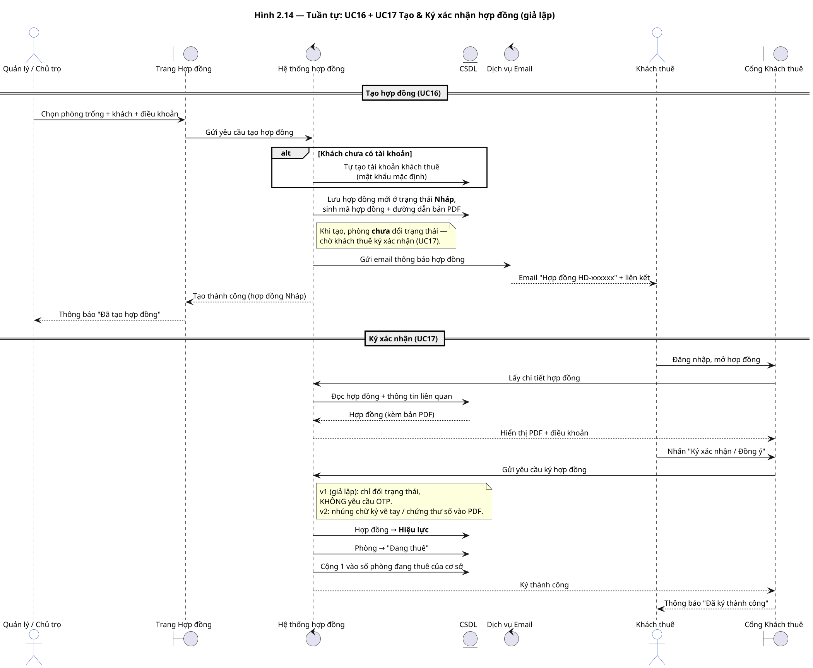
```plantuml
@startuml Seq_Contract_Sign
title Hình 2.14 — Tuần tự: UC16 + UC17 Tạo & Ký xác nhận hợp đồng (giả lập)

skinparam dpi 150
skinparam shadowing false
skinparam defaultFontName "Segoe UI"
skinparam defaultFontSize 12
skinparam sequenceMessageAlign center
skinparam ParticipantBackgroundColor #E6F5EA
skinparam ParticipantBorderColor #2E7D32
skinparam ActorBackgroundColor #FFFFFF
skinparam ActorBorderColor #3A5BC7

actor    "Quản lý / Chủ trọ" as Mgr
boundary "Trang Hợp đồng"    as UI
control  "Hệ thống hợp đồng" as Ctrl
entity   "CSDL"              as DB
control  "Dịch vụ Email"     as Mail
actor    "Khách thuê"        as Tenant
boundary "Cổng Khách thuê"   as TUI

== Tạo hợp đồng (UC16) ==
Mgr -> UI : Chọn phòng trống + khách + điều khoản
UI -> Ctrl : Gửi yêu cầu tạo hợp đồng
alt Khách chưa có tài khoản
  Ctrl -> DB : Tự tạo tài khoản khách thuê\n(mật khẩu mặc định)
end
Ctrl -> DB : Lưu hợp đồng mới ở trạng thái **Nháp**,\nsinh mã hợp đồng + đường dẫn bản PDF
note right of Ctrl
  Khi tạo, phòng **chưa** đổi trạng thái —
  chờ khách thuê ký xác nhận (UC17).
end note
Ctrl -> Mail : Gửi email thông báo hợp đồng
Mail --> Tenant : Email "Hợp đồng HD-xxxxxx" + liên kết
Ctrl --> UI : Tạo thành công (hợp đồng Nháp)
UI --> Mgr : Thông báo "Đã tạo hợp đồng"

== Ký xác nhận (UC17) ==
Tenant -> TUI : Đăng nhập, mở hợp đồng
TUI -> Ctrl : Lấy chi tiết hợp đồng
Ctrl -> DB : Đọc hợp đồng + thông tin liên quan
DB --> Ctrl : Hợp đồng (kèm bản PDF)
Ctrl --> TUI : Hiển thị PDF + điều khoản
Tenant -> TUI : Nhấn "Ký xác nhận / Đồng ý"
TUI -> Ctrl : Gửi yêu cầu ký hợp đồng
note right of Ctrl
  v1 (giả lập): chỉ đổi trạng thái,
  KHÔNG yêu cầu OTP.
  v2: nhúng chữ ký vẽ tay / chứng thư số vào PDF.
end note
Ctrl -> DB : Hợp đồng → **Hiệu lực**
Ctrl -> DB : Phòng → "Đang thuê"
Ctrl -> DB : Cộng 1 vào số phòng đang thuê của cơ sở
Ctrl --> TUI : Ký thành công
TUI --> Tenant : Thông báo "Đã ký thành công"

@enduml
```

## 2.15_seq_meter_invoice.puml

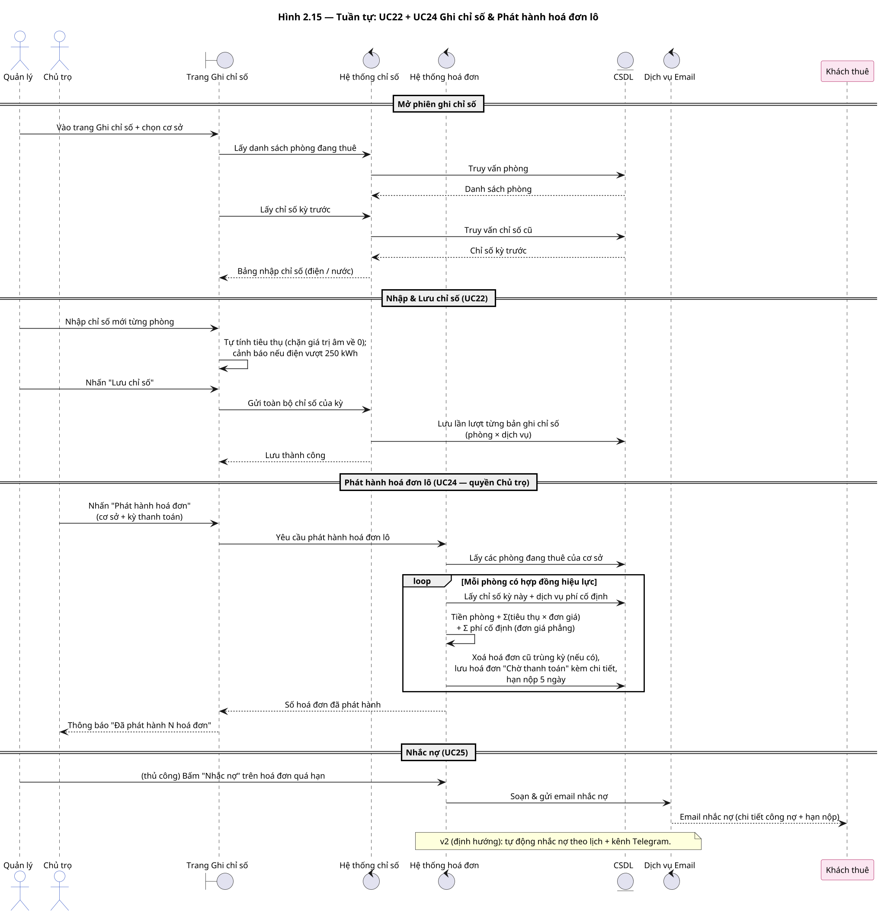
```plantuml
@startuml Seq_Meter_Invoice
title Hình 2.15 — Tuần tự: UC22 + UC24 Ghi chỉ số & Phát hành hoá đơn lô

skinparam dpi 150
skinparam shadowing false
skinparam defaultFontName "Segoe UI"
skinparam defaultFontSize 12
skinparam sequenceMessageAlign center
skinparam ParticipantBackgroundColor #FBE6F1
skinparam ParticipantBorderColor #AD1457
skinparam ActorBackgroundColor #FFFFFF
skinparam ActorBorderColor #3A5BC7

actor    "Quản lý"           as Mgr
actor    "Chủ trọ"           as Owner
boundary "Trang Ghi chỉ số"  as UI
control  "Hệ thống chỉ số"   as Meter
control  "Hệ thống hoá đơn"  as Bill
entity   "CSDL"              as DB
control  "Dịch vụ Email"     as Mail

== Mở phiên ghi chỉ số ==
Mgr -> UI : Vào trang Ghi chỉ số + chọn cơ sở
UI -> Meter : Lấy danh sách phòng đang thuê
Meter -> DB : Truy vấn phòng
DB --> Meter : Danh sách phòng
UI -> Meter : Lấy chỉ số kỳ trước
Meter -> DB : Truy vấn chỉ số cũ
DB --> Meter : Chỉ số kỳ trước
Meter --> UI : Bảng nhập chỉ số (điện / nước)

== Nhập & Lưu chỉ số (UC22) ==
Mgr -> UI : Nhập chỉ số mới từng phòng
UI -> UI : Tự tính tiêu thụ (chặn giá trị âm về 0);\ncảnh báo nếu điện vượt 250 kWh
Mgr -> UI : Nhấn "Lưu chỉ số"
UI -> Meter : Gửi toàn bộ chỉ số của kỳ
Meter -> DB : Lưu lần lượt từng bản ghi chỉ số\n(phòng × dịch vụ)
Meter --> UI : Lưu thành công

== Phát hành hoá đơn lô (UC24 — quyền Chủ trọ) ==
Owner -> UI : Nhấn "Phát hành hoá đơn"\n(cơ sở + kỳ thanh toán)
UI -> Bill : Yêu cầu phát hành hoá đơn lô
Bill -> DB : Lấy các phòng đang thuê của cơ sở
loop Mỗi phòng có hợp đồng hiệu lực
  Bill -> DB : Lấy chỉ số kỳ này + dịch vụ phí cố định
  Bill -> Bill : Tiền phòng + Σ(tiêu thụ × đơn giá)\n+ Σ phí cố định (đơn giá phẳng)
  Bill -> DB : Xoá hoá đơn cũ trùng kỳ (nếu có),\nlưu hoá đơn "Chờ thanh toán" kèm chi tiết,\nhạn nộp 5 ngày
end
Bill --> UI : Số hoá đơn đã phát hành
UI --> Owner : Thông báo "Đã phát hành N hoá đơn"

== Nhắc nợ (UC25) ==
Mgr -> Bill : (thủ công) Bấm "Nhắc nợ" trên hoá đơn quá hạn
Bill -> Mail : Soạn & gửi email nhắc nợ
Mail --> "Khách thuê" : Email nhắc nợ (chi tiết công nợ + hạn nộp)
note over Bill, Mail
  v2 (định hướng): tự động nhắc nợ theo lịch + kênh Telegram.
end note

@enduml
```

## 2.16_seq_payment_vnpay.puml

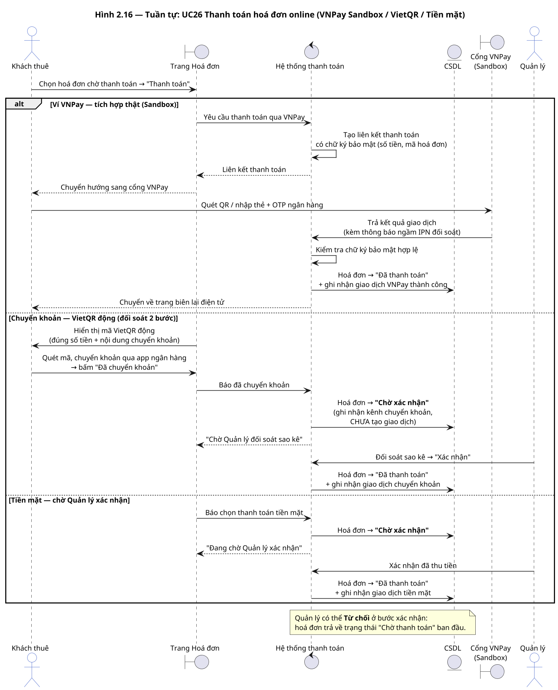
```plantuml
@startuml Seq_Payment_Online
title Hình 2.16 — Tuần tự: UC26 Thanh toán hoá đơn online (VNPay Sandbox / VietQR / Tiền mặt)

skinparam dpi 150
skinparam shadowing false
skinparam defaultFontName "Segoe UI"
skinparam defaultFontSize 12
skinparam sequenceMessageAlign center
skinparam ParticipantBackgroundColor #E0F2F1
skinparam ParticipantBorderColor #00695C
skinparam ActorBackgroundColor #FFFFFF
skinparam ActorBorderColor #3A5BC7

actor    "Khách thuê"        as Tenant
boundary "Trang Hoá đơn"     as UI
control  "Hệ thống thanh toán" as Pay
entity   "CSDL"              as DB
boundary "Cổng VNPay\n(Sandbox)" as VNP
actor    "Quản lý"           as Mgr

Tenant -> UI : Chọn hoá đơn chờ thanh toán → "Thanh toán"

alt Ví VNPay — tích hợp thật (Sandbox)
  UI -> Pay : Yêu cầu thanh toán qua VNPay
  Pay -> Pay : Tạo liên kết thanh toán\ncó chữ ký bảo mật (số tiền, mã hoá đơn)
  Pay --> UI : Liên kết thanh toán
  UI --> Tenant : Chuyển hướng sang cổng VNPay
  Tenant -> VNP : Quét QR / nhập thẻ + OTP ngân hàng
  VNP -> Pay : Trả kết quả giao dịch\n(kèm thông báo ngầm IPN đối soát)
  Pay -> Pay : Kiểm tra chữ ký bảo mật hợp lệ
  Pay -> DB : Hoá đơn → "Đã thanh toán"\n+ ghi nhận giao dịch VNPay thành công
  Pay --> Tenant : Chuyển về trang biên lai điện tử
else Chuyển khoản — VietQR động (đối soát 2 bước)
  UI -> Tenant : Hiển thị mã VietQR động\n(đúng số tiền + nội dung chuyển khoản)
  Tenant -> UI : Quét mã, chuyển khoản qua app ngân hàng\n→ bấm "Đã chuyển khoản"
  UI -> Pay : Báo đã chuyển khoản
  Pay -> DB : Hoá đơn → **"Chờ xác nhận"**\n(ghi nhận kênh chuyển khoản,\nCHƯA tạo giao dịch)
  Pay --> UI : "Chờ Quản lý đối soát sao kê"
  Mgr -> Pay : Đối soát sao kê → "Xác nhận"
  Pay -> DB : Hoá đơn → "Đã thanh toán"\n+ ghi nhận giao dịch chuyển khoản
else Tiền mặt — chờ Quản lý xác nhận
  UI -> Pay : Báo chọn thanh toán tiền mặt
  Pay -> DB : Hoá đơn → **"Chờ xác nhận"**
  Pay --> UI : "Đang chờ Quản lý xác nhận"
  Mgr -> Pay : Xác nhận đã thu tiền
  Pay -> DB : Hoá đơn → "Đã thanh toán"\n+ ghi nhận giao dịch tiền mặt
end

note over Pay, DB
  Quản lý có thể **Từ chối** ở bước xác nhận:
  hoá đơn trả về trạng thái "Chờ thanh toán" ban đầu.
end note

@enduml
```

## 2.17_seq_chatbot_ai.puml

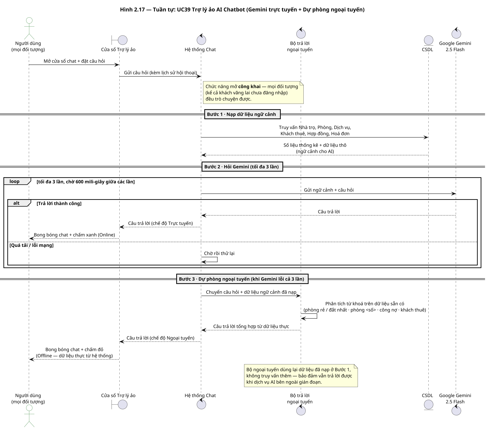
```plantuml
@startuml Seq_Chatbot_AI
title Hình 2.17 — Tuần tự: UC39 Trợ lý ảo AI Chatbot (Gemini trực tuyến + Dự phòng ngoại tuyến)

skinparam dpi 150
skinparam shadowing false
skinparam defaultFontName "Segoe UI"
skinparam defaultFontSize 12
skinparam sequenceMessageAlign center
skinparam ParticipantBackgroundColor #E6F0FA
skinparam ParticipantBorderColor #1F3864
skinparam ActorBackgroundColor #FFFFFF
skinparam ActorBorderColor #2E7D32

actor    "Người dùng\n(mọi đối tượng)" as User
boundary "Cửa sổ Trợ lý ảo"  as UI
control  "Hệ thống Chat"      as Ctrl
control  "Bộ trả lời\nngoại tuyến" as FB
entity   "CSDL"               as DB
control  "Google Gemini\n2.5 Flash" as Gem

User -> UI : Mở cửa sổ chat + đặt câu hỏi
UI -> Ctrl : Gửi câu hỏi (kèm lịch sử hội thoại)
note right of Ctrl
  Chức năng mở **công khai** — mọi đối tượng
  (kể cả khách vãng lai chưa đăng nhập)
  đều trò chuyện được.
end note

== Bước 1 · Nạp dữ liệu ngữ cảnh ==
Ctrl -> DB : Truy vấn Nhà trọ, Phòng, Dịch vụ,\nKhách thuê, Hợp đồng, Hoá đơn
DB --> Ctrl : Số liệu thống kê + dữ liệu thô\n(ngữ cảnh cho AI)

== Bước 2 · Hỏi Gemini (tối đa 3 lần) ==
loop tối đa 3 lần, chờ 600 mili-giây giữa các lần
  Ctrl -> Gem : Gửi ngữ cảnh + câu hỏi
  alt Trả lời thành công
    Gem --> Ctrl : Câu trả lời
    Ctrl --> UI : Câu trả lời (chế độ Trực tuyến)
    UI --> User : Bong bóng chat + chấm xanh (Online)
  else Quá tải / lỗi mạng
    Ctrl -> Ctrl : Chờ rồi thử lại
  end
end

== Bước 3 · Dự phòng ngoại tuyến (khi Gemini lỗi cả 3 lần) ==
Ctrl -> FB : Chuyển câu hỏi + dữ liệu ngữ cảnh đã nạp
FB -> FB : Phân tích từ khoá trên dữ liệu sẵn có\n(phòng rẻ / đắt nhất · phòng <số> · công nợ · khách thuê)
FB --> Ctrl : Câu trả lời tổng hợp từ dữ liệu thực
Ctrl --> UI : Câu trả lời (chế độ Ngoại tuyến)
UI --> User : Bong bóng chat + chấm đỏ\n(Offline — dữ liệu thực từ hệ thống)

note over FB
  Bộ ngoại tuyến dùng lại dữ liệu đã nạp ở Bước 1,
  không truy vấn thêm — bảo đảm vẫn trả lời được
  khi dịch vụ AI bên ngoài gián đoạn.
end note

@enduml
```

## 2.18_architecture.puml

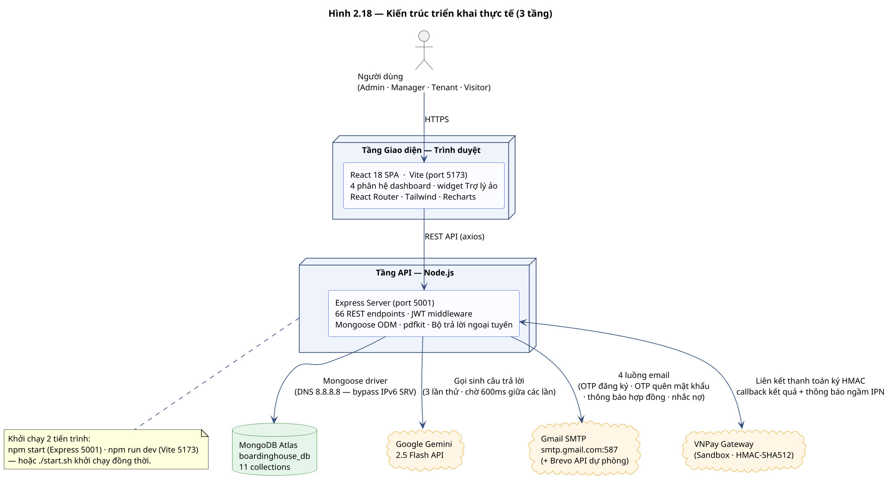
```plantuml
@startuml Architecture_Deployment
title Hình 2.18 — Kiến trúc triển khai thực tế (3 tầng)

skinparam dpi 150
skinparam shadowing false
skinparam defaultFontName "Segoe UI"
skinparam defaultFontSize 12
skinparam componentStyle rectangle
skinparam ArrowColor #34507A
skinparam component {
  BackgroundColor #FAFCFF
  BorderColor #3A5BC7
}
skinparam node {
  BackgroundColor #EEF3FC
  BorderColor #1F3864
}
skinparam cloud {
  BackgroundColor #FFF6E5
  BorderColor #E59300
}
skinparam database {
  BackgroundColor #E6F5EA
  BorderColor #2E7D32
}

actor "Người dùng\n(Admin · Manager · Tenant · Visitor)" as User

node "Tầng Giao diện — Trình duyệt" as N1 {
  component "React 18 SPA  ·  Vite (port 5173)\n4 phân hệ dashboard · widget Trợ lý ảo\nReact Router · Tailwind · Recharts" as FE
}

node "Tầng API — Node.js" as N2 {
  component "Express Server (port 5001)\n66 REST endpoints · JWT middleware\nMongoose ODM · pdfkit · Bộ trả lời ngoại tuyến" as BE
}

database "MongoDB Atlas\nboardinghouse_db\n11 collections" as DB

cloud "Google Gemini\n2.5 Flash API" as GEM
cloud "Gmail SMTP\nsmtp.gmail.com:587\n(+ Brevo API dự phòng)" as SMTP
cloud "VNPay Gateway\n(Sandbox · HMAC-SHA512)" as VNP

User --> FE : HTTPS
FE --> BE : REST API (axios)
BE --> DB : Mongoose driver\n(DNS 8.8.8.8 — bypass IPv6 SRV)
BE --> GEM : Gọi sinh câu trả lời\n(3 lần thử · chờ 600ms giữa các lần)
BE --> SMTP : 4 luồng email\n(OTP đăng ký · OTP quên mật khẩu\n· thông báo hợp đồng · nhắc nợ)
BE <--> VNP : Liên kết thanh toán ký HMAC\ncallback kết quả + thông báo ngầm IPN

note bottom of N2
  Khởi chạy 2 tiến trình:
  npm start (Express 5001) · npm run dev (Vite 5173)
  — hoặc ./start.sh khởi chạy đồng thời.
end note

@enduml
```
