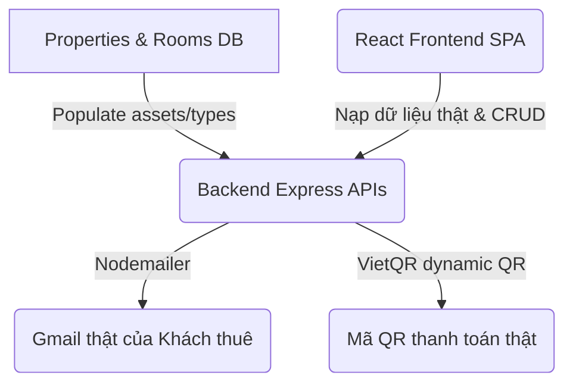

# Kế hoạch điều chỉnh hệ thống theo báo cáo đối chiếu Use Cases

Kế hoạch này tập trung vào việc bổ sung mã nguồn thực tế cho Backend (Express) và kết nối đồng bộ với Frontend (React) để hoàn thiện 10 Use Cases (UC) còn sai lệch hoặc ở trạng thái giả lập, đáp ứng 100% yêu cầu vận hành thật của người dùng.

---

## 📌 Các nội dung trọng tâm điều chỉnh

Chúng ta sẽ bỏ qua **UC02** (đặc tả sẽ điều chỉnh lại) và tập trung xử lý triệt để 10 UC sau:

1. **UC03 (Đăng xuất)**: Thêm API đăng xuất phía Backend, Frontend gọi API này để hủy phiên.
2. **UC11 (Quản lý loại phòng)**: Xây dựng hoàn chỉnh API CRUD và Giao diện quản lý loại phòng & tiện nghi (FE + BE).
3. **UC14 (Quản lý tài sản)**: Bổ sung API cập nhật mảng tài sản của phòng và giao diện chỉnh sửa trực quan tại Sơ đồ phòng.
4. **UC17 (Ký hợp đồng)**: Đơn giản hóa cơ chế ký số bằng checkbox đồng ý điều khoản, cập nhật trạng thái hợp đồng và phòng xuống DB thật.
5. **UC19 (Sửa hợp đồng)**: Bổ sung API cập nhật điều khoản hợp đồng và giao diện chỉnh sửa hợp đồng cho Admin/Manager.
6. **UC26 (Tự sinh hóa đơn)**: Tích hợp cơ chế tự động quét hợp đồng `active` để sinh hóa đơn định kỳ hàng tháng trong DB.
7. **UC27 (Thanh toán online & QR thật)**: Thêm cấu hình ảnh QR thanh toán cho từng nhà trọ, tự động sinh VietQR thật kèm số tiền và nội dung chuyển khoản khi khách thuê thanh toán.
8. **UC30 (Quản lý công nợ)**: Kết nối giao diện công nợ FE gọi trực tiếp API tổng hợp công nợ của BE.
9. **UC34 (Báo cáo công nợ)**: Tinh chỉnh tab báo cáo công nợ của Admin kết nối dữ liệu thật từ DB.
10. **UC37 (Thông báo Gmail thật)**: Sử dụng Nodemailer gửi email thật cho khách thuê khi: (1) Lập hợp đồng mới gửi link ký, (2) Click nhắc nợ công nợ gửi thông báo nợ chi tiết.

---

## 🛠️ Chi tiết các thay đổi đề xuất



### 1. Phân hệ Backend (Express API)

#### [MODIFY] [server.js](file:///Users/dieptuhuy/Library/CloudStorage/GoogleDrive-dieptuhuy80@gmail.com/Other%20computers/My%20Computer%203/D:/Study/System_Design/src/backend/server.js)
* **UC03**: Thêm API đăng xuất `POST /api/auth/logout` ghi nhận sự kiện đăng xuất.
* **UC11**: Thêm các CRUD API cho loại phòng (`RoomType`):
  * `GET /api/properties/:propertyId/room-types` (Danh sách loại phòng)
  * `POST /api/room-types` (Tạo mới loại phòng)
  * `PUT /api/room-types/:id` (Cập nhật loại phòng)
  * `DELETE /api/room-types/:id` (Xóa loại phòng)
* **UC14**: Cập nhật hàm helper `mapRoom(roomDoc)` trả về mảng `assets` (tài sản) được lưu trong CSDL:
  ```javascript
  assets: (room.taiSan || []).map(a => ({
    id: a._id ? a._id.toString() : Math.random().toString(),
    name: a.tenTaiSan,
    value: a.giaTri,
    condition: a.tinhTrang
  }))
  ```
* **UC17**: Thêm API ký hợp đồng `PATCH /api/contracts/:id/sign`. API này sẽ:
  * Đổi trạng thái hợp đồng thành `active`.
  * Tự động cập nhật trạng thái phòng trọ liên quan thành `rented` (occupied).
* **UC19**: Thêm API sửa đổi thông tin hợp đồng `PUT /api/contracts/:id`.
* **UC26**: Viết hàm tự động quét hợp đồng `active` để sinh hóa đơn nháp/chính thức cho kỳ hiện tại (`kyThanhToan` định dạng `YYYY-MM`) nếu phòng đó chưa được lập hóa đơn. Hàm này sẽ chạy khi khởi động server và lặp lại mỗi 24 giờ.
* **UC27**: Thêm API `/api/invoices/:id/payment-info` lấy ảnh QR của nhà trọ (nếu có) hoặc tự sinh URL VietQR chuyển khoản ngân hàng thật dựa trên số tiền hóa đơn và số tài khoản của nhà trọ.
* **UC37**: Thêm API gửi email nhắc nợ `POST /api/reports/debts/:invoiceId/remind` để kích hoạt gửi email thông báo chi tiết số tiền nợ và hạn đóng thật qua Gmail của khách thuê.

#### [MODIFY] [Property.js](file:///Users/dieptuhuy/Library/CloudStorage/GoogleDrive-dieptuhuy80@gmail.com/Other%20computers/My%20Computer%203/D:/Study/System_Design/src/backend/models/Property.js)
* Bổ sung trường `qrCodeUrl: { type: String }` để lưu đường dẫn ảnh mã QR thanh toán do Admin tải lên cho từng cơ sở nhà trọ.

#### [MODIFY] [emailService.js](file:///Users/dieptuhuy/Library/CloudStorage/GoogleDrive-dieptuhuy80@gmail.com/Other%20computers/My%20Computer%203/D:/Study/System_Design/src/backend/services/emailService.js)
* Viết thêm 2 mẫu email HTML cao cấp, trang trọng gửi qua SMTP thật:
  1. `sendContractNotificationEmail(email, fullName, contractCode, monthlyRent, deposit, startDate, endDate)`: Gửi liên kết thông báo ký hợp đồng mới.
  2. `sendDebtReminderEmail(email, fullName, amount, dueDate, invoiceCode, period)`: Gửi thông báo nhắc nợ hóa đơn trễ hạn thật kèm số tiền và hạn đóng.

---

### 2. Phân hệ Frontend (React SPA)

#### [NEW] [roomTypeService.js](file:///Users/dieptuhuy/Library/CloudStorage/GoogleDrive-dieptuhuy80@gmail.com/Other%20computers/My%20Computer%203/D:/Study/System_Design/src/frontend/src/services/roomTypeService.js)
* Xây dựng client-service kết nối với các CRUD API `/api/room-types` của backend.

#### [NEW] [RoomTypesPage.jsx](file:///Users/dieptuhuy/Library/CloudStorage/GoogleDrive-dieptuhuy80@gmail.com/Other%20computers/My%20Computer%203/D:/Study/System_Design/src/frontend/src/views/admin/RoomTypesPage.jsx)
* Trang quản lý Loại phòng & Tiện nghi dành cho Admin/Manager:
  * Xem danh sách loại phòng của nhà trọ được chọn.
  * Thêm loại phòng mới (tên loại phòng, diện tích, giá cơ bản, danh sách tiện nghi).
  * Chỉnh sửa thông tin loại phòng, xóa loại phòng.
  * Thiết kế Apple-style sang trọng, mượt mà.

#### [MODIFY] [AppRouter.jsx](file:///Users/dieptuhuy/Library/CloudStorage/GoogleDrive-dieptuhuy80@gmail.com/Other%20computers/My%20Computer%203/D:/Study/System_Design/src/frontend/src/routes/AppRouter.jsx)
* Khai báo route quản lý loại phòng `/admin/room-types` và `/manager/room-types`.

#### [MODIFY] [AdminLayout.jsx](file:///Users/dieptuhuy/Library/CloudStorage/GoogleDrive-dieptuhuy80@gmail.com/Other%20computers/My%20Computer%203/D:/Study/System_Design/src/frontend/src/layouts/AdminLayout.jsx) & [ManagerLayout.jsx](file:///Users/dieptuhuy/Library/CloudStorage/GoogleDrive-dieptuhuy80@gmail.com/Other%20computers/My%20Computer%203/D:/Study/System_Design/src/frontend/src/layouts/ManagerLayout.jsx)
* Bổ sung mục menu "Loại phòng & Tiện nghi" vào Sidebar điều hướng với hiệu ứng Active Indicator trượt mượt mà.

#### [MODIFY] [RoomsPage.jsx (Manager)](file:///Users/dieptuhuy/Library/CloudStorage/GoogleDrive-dieptuhuy80@gmail.com/Other%20computers/My%20Computer%203/D:/Study/System_Design/src/frontend/src/views/manager/RoomsPage.jsx)
* **UC14 (Quản lý tài sản)**:
  * Trong Panel chi tiết phòng trọ ở lề phải, thêm phần danh sách tài sản (dưới dạng bảng/danh sách nhỏ hiển thị Tên tài sản, Giá trị, Tình trạng).
  * Thêm nút "Cập nhật tài sản" mở một modal cho phép Quản lý thêm tài sản mới, sửa thông tin hoặc xóa tài sản.
  * Khi lưu, gọi API `PUT /api/rooms/:id` gửi mảng tài sản mới cập nhật xuống cơ sở dữ liệu thật.

#### [MODIFY] [ContractsPage.jsx (Tenant)](file:///Users/dieptuhuy/Library/CloudStorage/GoogleDrive-dieptuhuy80@gmail.com/Other%20computers/My%20Computer%203/D:/Study/System_Design/src/frontend/src/views/tenant/ContractsPage.jsx)
* **UC17 (Ký hợp đồng)**:
  * Đối với các hợp đồng có trạng thái `draft` (Chờ ký), bổ sung nút **"Tiến hành ký hợp đồng"** nổi bật.
  * Khi Tenant nhấp chọn, hiển thị Modal Xem & Ký Hợp Đồng chứa văn bản hợp đồng chi tiết, kèm theo checkbox:
    `[ ] Tôi đã đọc và đồng ý với toàn bộ các điều khoản của Hợp đồng thuê phòng trọ.`
  * Nút "Ký số điện tử" chỉ active khi checkbox được tick. Khi click, gọi API `PATCH /api/contracts/:id/sign` chuyển trạng thái sang `active` thật trên DB.

#### [MODIFY] [ContractsPage.jsx (Manager/Admin)](file:///Users/dieptuhuy/Library/CloudStorage/GoogleDrive-dieptuhuy80@gmail.com/Other%20computers/My%20Computer%203/D:/Study/System_Design/src/frontend/src/views/manager/ContractsPage.jsx)
* **UC19 (Sửa hợp đồng)**:
  * Thêm nút "Chỉnh sửa hợp đồng" cho các hợp đồng ở trạng thái `draft`.
  * Hiển thị Modal chỉnh sửa các thông số cốt lõi (Ngày bắt đầu, ngày kết thúc, tiền cọc, tiền phòng) và lưu thật xuống DB qua API `PUT /api/contracts/:id`.

#### [MODIFY] [PropertiesPage.jsx (Admin)](file:///Users/dieptuhuy/Library/CloudStorage/GoogleDrive-dieptuhuy80@gmail.com/Other%20computers/My%20Computer%203/D:/Study/System_Design/src/frontend/src/views/admin/PropertiesPage.jsx)
* **UC27 (Tải ảnh QR của Admin)**:
  * Trong Modal thêm/sửa thông tin nhà trọ, bổ sung trường nhập: **"Đường dẫn ảnh mã QR thanh toán"** (URL hoặc cho phép điền đường dẫn ảnh QR nhận tiền thật của Admin). Trường này lưu vào `qrCodeUrl` của cơ sở.

#### [MODIFY] [InvoicesPage.jsx (Tenant)](file:///Users/dieptuhuy/Library/CloudStorage/GoogleDrive-dieptuhuy80@gmail.com/Other%20computers/My%20Computer%203/D:/Study/System_Design/src/frontend/src/views/tenant/InvoicesPage.jsx)
* **UC27 (Thanh toán online bằng QR thật)**:
  * Trong Modal thanh toán trực tuyến (`payStep === 2`), khi Tenant chọn VNPay hoặc MoMo, hệ thống sẽ:
    1. Lấy `qrCodeUrl` của nhà trọ đó từ thông tin cơ sở.
    2. Nếu cơ sở có ảnh QR, hiển thị ảnh QR thật này để khách hàng quét.
    3. Nếu chưa có ảnh QR, tự động tạo mã QR VietQR động (chứa số tài khoản mặc định, số tiền hóa đơn thật, nội dung chuyển khoản tự động có mã hóa đơn).
  * Thêm hướng dẫn chuyển khoản và nút **"Tôi đã chuyển khoản thành công"** để khách hàng gửi xác nhận thanh toán (chuyển trạng thái sang `paid` thực tế).

#### [MODIFY] [DebtsPage.jsx (Admin)](file:///Users/dieptuhuy/Library/CloudStorage/GoogleDrive-dieptuhuy80@gmail.com/Other%20computers/My%20Computer%203/D:/Study/System_Design/src/frontend/src/views/admin/DebtsPage.jsx)
* **UC30 (Quản lý công nợ)** & **UC37 (Nhắc nợ qua email thật)**:
  * Thay thế việc dùng hook `useInvoices` và group thủ công ở FE bằng việc dùng trực tiếp:
    ```javascript
    const { data: debts = [], loading } = useFetch(() => reportService.getDebts(), []);
    ```
  * Hiển thị danh sách nợ động từ API `/api/reports/debts` thật của backend.
  * Khi click nút **"Gửi nhắc nợ"** cho từng khách thuê, gọi API `POST /api/reports/debts/:invoiceId/remind` ở backend để gửi email nhắc nợ thật chi tiết qua Gmail của khách trọ đó.

#### [MODIFY] [ReportsPage.jsx (Admin)](file:///Users/dieptuhuy/Library/CloudStorage/GoogleDrive-dieptuhuy80@gmail.com/Other%20computers/My%20Computer%203/D:/Study/System_Design/src/frontend/src/views/admin/ReportsPage.jsx)
* **UC34 (Báo cáo công nợ)**:
  * Đảm bảo Tab Công nợ (`debt`) hiển thị đầy đủ số liệu nợ của từng cơ sở từ CSDL thật.
  * Tích hợp thêm một bảng số liệu tóm tắt công nợ chi tiết ở dưới biểu đồ để tối ưu hóa khả năng đối soát của Admin.

---

## 📈 Kế hoạch kiểm thử & nghiệm thu

1. **Kiểm thử tự động**:
   * Chạy lại bộ test cases Python nghiệp vụ để đảm bảo các thay đổi không làm ảnh hưởng đến các tính năng cốt lõi khác.
2. **Kiểm thử thủ công**:
   * Đăng nhập Admin: Tạo/Sửa loại phòng mới (UC11), tải ảnh QR cho nhà trọ (UC27), xem biểu đồ công nợ thật (UC34).
   * Đăng nhập Manager: Quản lý và cập nhật tài sản trong phòng (UC14), lập hợp đồng mới (UC16) -> tự động gửi email thông báo kèm link ký thật qua Gmail (UC37).
   * Đăng nhập Tenant: Vào trang Hợp đồng -> nhấp chọn Hợp đồng Chờ ký -> tick đồng ý điều khoản -> click ký số (UC17) -> hợp đồng kích hoạt thành công.
   * Đăng nhập Tenant: Vào trang Hóa đơn -> Click thanh toán online -> hiển thị mã QR thật khớp số tiền (UC27) -> click hoàn tất thanh toán.
   * Đăng nhập Admin: Vào trang Công nợ (UC30) -> Click nhắc nợ khách thuê trễ hạn -> tự động gửi email nhắc nợ thật kèm chi tiết tiền phòng/hạn đóng qua Gmail khách thuê (UC37).
